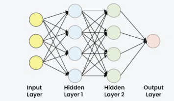
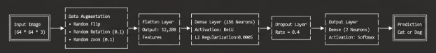
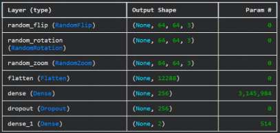
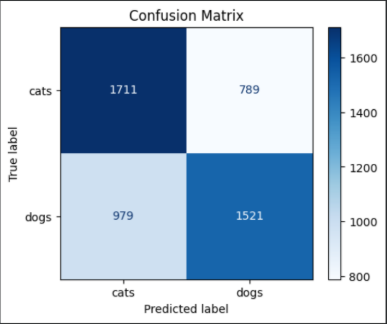
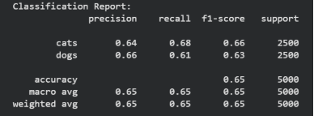

# Artificial Neural Network for Cat and Dog Image Classification
## 1\. Limitation of Simple ANN for Image Classification
- Image classification is a common machine learning task where the model receives an image as input and predicts the class of that image. In this project, the model is used to classify images into two classes: cats and dogs.
- A simple Artificial Neural Network can be used for image classification, but it has several limitations when working with image data. An image is not only a collection of pixel values. It also contains spatial information, such as edges, shapes, textures, and the relative positions of objects. For example, in a cat or dog image, the position of eyes, ears, nose, and body shape is important for classification.
- However, a simple ANN usually cannot process image structure directly. Before an image is passed into the Dense layers, it must be converted into a one-dimensional vector by using a Flatten layer.
- In this project, each image is resized to: 

64×64 ×3

Where:

- 64 is the image height
- 64 is the image width
- 3 represents the RGB color channels
- After applying the Flatten layer, the image becomes:\
  64×64 ×3= 12288
- Therefore, each image is converted into a vector:\
  X = [x1,  x2,  x3,  ...,  x12288]
- This flattening process causes the model to lose spatial relationships between neighboring pixels. For example, two pixels that are close to each other in the original image may no longer have a clear spatial relationship after the image is flattened. As a result, the model may have difficulty learning local image features such as edges, corners, and object parts.
- Another limitation is that the input vector is still large. Even though the image size is reduced to 64×64, each image still has 12,288 input features. This means the Dense layer needs to learn many parameters. If the dataset is not large enough or the model is not regularized properly, the model can easily overfit.
- To reduce overfitting, this project uses data augmentation, L2 regularization, and Dropout. Data augmentation randomly changes the training images by flipping, rotating, and zooming them. L2 regularization penalizes large weights, while Dropout randomly removes some neurons during training. These techniques help the ANN generalize better.
- However, even with these improvements, ANN is still limited for image classification because it does not preserve spatial information as effectively as CNN or ResNet. Therefore, this ANN model is suitable as a baseline model, while CNN or ResNet is usually expected to achieve better performance for image classification tasks.
## 2\. Artificial Neural Network
- Artificial Neural Network, or ANN, is a machine learning model inspired by the human brain. It consists of many artificial neurons connected together. A basic ANN usually contains three main parts: an input layer, one or more hidden layers, and an output layer.
- Each neuron receives input values, multiplies them by weights, adds a bias, and then applies an activation function. The computation of one neuron can be represented as:\
  z = w1x1 + w2x2 + ... + wnxn+ b
- In vector form, it can be written as:\
  z = W^TX + b

  Where:

  - X is the input vector
  - W is the weight vector
  - b is the bias
  - z is the linear output before applying the activation function.
- After that, the activation function is applied:\
  a = f(z)

  Where: 

  - a is the output of the neuron after activation.	

- In this project, the ANN model uses a Dense hidden layer with ReLU activation. The formula of ReLU is:\
  ReLU(x) = max(0, x)
- This means that if (x < 0), the output is 0. If (x > 0), the output keeps the original value. ReLU helps the model learn non-linear relationships in the data.
- The output layer uses the Softmax activation function because this is a multi-class classification problem with two classes: cats and dogs. The Softmax function is defined as:\
  Softmaxzi= e^zij=1Ke^zj

  Where: 

  - K is the number of classes. In this project, (K = 2). 
- Therefore, the probabilities for cat and dog can be written as:

Pcat= e^zcate^zcat+ e^zdog

Pdog= e^zdoge^zcat+ e^zdog

- The class with the highest probability is selected as the final prediction:\
  y= argmaxPcat, Pdog
- For example, if the model outputs:
  - P(cat) = 0.20
  - P(dog) = 0.80

then the final prediction is dog.

- In this updated model, the ANN also includes several techniques to improve generalization. First, data augmentation is applied before the Flatten layer. It includes random horizontal flipping, random rotation, and random zooming. These transformations help the model learn more robust patterns from images.
- Second, L2 regularization is applied to the Dense hidden layer. The regularized loss can be written as:

\
  Ltotal= Lcross entropy+ λW2 

  Where:

  - λ controls the strength of the penalty. 
- In this project:\
  λ= 0.0005
- L2 regularization helps prevent the weights from becoming too large and reduces overfitting.
- Third, Dropout is used after the Dense hidden layer. The dropout rate is:\
  p = 0.4
- This means that during training, 40% of the neurons are randomly deactivated. Dropout helps the model avoid depending too much on specific neurons.
- Overall, the ANN in this project can be summarized as:\
  Input64 ×64 ×3→Augmentation →Flatten →Dense256, ReLU→Dropout0.4→Dense2, Softmax
## 3\. ANN for Cat and Dog Classification
- In this project, the dataset is used to classify images into two categories: cats and dogs. The labels are encoded as:\
  cats = 0,  dogs = 1

- The dataset is divided into training data and validation data using an 80/20 split. Stratified splitting is applied so that the proportion of cat and dog images is preserved in both the training set and validation set.
- Before training, each image is loaded and preprocessed. First, the image is read from its file path and decoded as an RGB image with 3 channels. After that, it is resized to:\
  64 ×64
- The pixel values are then normalized by dividing by 255:\
  x' = x255

  Where:

  - x is the original pixel value 
  - x' is the normalized pixel value
- Since original pixel values are usually in the range from 0 to 255, normalization changes them into the range:\
  0 ≤x'≤1

  This helps the model train more efficiently and makes the input values more stable.

- The batch size used in this project is:\
  batch\_size = 32
- The TensorFlow Dataset pipeline is used to shuffle, map, batch, and prefetch the data. This helps the training process become more efficient

- The ANN architecture used in this project is: 

- The first three layers are data augmentation layers. They randomly transform the training images to help the model generalize better. RandomFlip("horizontal") randomly flips images horizontally. RandomRotation(0.05) randomly rotates images by a small angle. RandomZoom(0.05) randomly zooms images slightly.
- After data augmentation, the Flatten layer converts each image from a three-dimensional matrix into a one-dimensional vector:\
  64 ×64 ×3 →12288
- The hidden Dense layer has 256 neurons and uses the ReLU activation function:\
  a[1]= ReLUW[1]X+ b1
- The ReLU activation function is defined as:\
  ReLU(x) = max(0, x)
- This layer also uses L2 regularization with:\
  λ= 0.0005
- L2 regularization adds a penalty term to the loss function:

  Ltotal= Lcross entropy+ λW2 

- This penalty discourages the model from learning very large weights, which helps reduce overfitting.
- After the hidden Dense layer, Dropout is applied with a dropout rate of:

  p = 0.4

- This means that during training, 40% of the neurons are randomly ignored. Dropout helps prevent the model from depending too much on specific neurons and improves generalization.
- The final layer is a Dense layer with 2 neurons and Softmax activation:\
  y= SoftmaxW[2]a1+ b2
- The output is:

  y= Pcat, Pdog

- The Softmax function is calculated as:\
  Softmaxzi= ezij=1Kezi
- Since there are two classes, the probabilities can be written as:\
  Pcat= ezcatezcat+ ezdog

  Pdog= ezdogezcat+ ezdog

- The model prediction is selected using:\
  class = argmaxy

  
## 4\. Training Process
- The model is compiled using the Adam optimizer, sparse categorical cross-entropy loss function, and accuracy as the evaluation metric.
- The optimizer used in this project is Adam with the learning rate:\
  α= 0.0001
- The loss function used in this project is sparse categorical cross-entropy. For one sample, the loss can be written as:\
  L = -logyy

  Where: 

  - yy is the predicted probability of the correct class.
- For the whole dataset, the average loss is:\
  Loss = -1Ni=1Nlogyiyi

Where: 

- N is the number of samples
- yi is the true label of sample i 
- yiyi is the predicted probability of the correct class for sample i
- During training, the optimizer updates the weights and biases to reduce the loss. The basic idea of parameter updating can be represented using gradient descent:

Wnew= Wold- α∂L∂W\
bnew= bold- α∂L∂b

Where: 

- α is the learning rate
- ∂L∂W is the gradient of the loss with respect to the weights*\
  ∂L∂b is the gradient of the loss with respect to the bias
- The model is trained for:\
  epochs = 30
- During training, two callbacks are used: **ReduceLROnPlateau** and **BestValAccuracyCheckpoint**.
- The **ReduceLROnPlateau** callback monitors the validation loss. If the validation loss does not improve for 2 epochs, the learning rate is reduced by a factor of 0.5:\
  αnew= 0.5 × αold
- The minimum learning rate is:

  αmin= 10-6

- This helps the model continue learning more carefully when the validation loss stops improving.
- The second callback is **BestValAccuracyCheckpoint**. This callback monitors validation accuracy. If the validation accuracy improves, the model is saved as:\
  best\_ann\_model.keras
- This ensures that the final evaluation uses the best model based on validation accuracy, not necessarily the model from the last epoch.

- After training, the training and validation curves are plotted. These curves show how the model performs across epochs.

- The accuracy formula is:\
  Accuracy =Number of correct predictionsTotal number of predictions
- Using confusion matrix notation, accuracy can also be written as:\
  Accuracy = TP + TNTP + TN + FP + FN

  Where: 

  - TP is true positive
  - TN is true negative
  - FP is false positive
  - FN is false negative
- If the training accuracy increases but the validation accuracy is much lower, the model may be overfitting. If both training accuracy and validation accuracy are low, the model may be underfitting. If both training and validation accuracy increase together, the model is learning useful patterns from the dataset.
## 5\. Test Result and Evaluation Metrics
- After training, the best saved model is loaded from:

best\_ann\_model.keras

- The model is then evaluated on the validation dataset. In this notebook, the validation set is used for evaluation because the Kaggle test set does not provide labels. Therefore, this section is called Validation Result instead of Test Result.
- The model outputs the probability of each class:

  y= Pcat, Pdog

- The final class is selected using:

  class = argmaxy

- The predicted labels are compared with the true labels. The evaluation is performed using a classification report and a confusion matrix.
- The confusion matrix for binary classification can be represented as:

  TNFPFNTP

  Where:

  - TP = dog images correctly predicted as dog
  - TP = dog images correctly predicted as dog
  - FP = cat images incorrectly predicted as dog
  - FN = dog images incorrectly predicted as cat

- Besides accuracy, precision, recall, and F1-score are used to evaluate the model.
- Precision measures how many images predicted as dogs are actually dog images. Precision is calculated as:\
  Precision = TPTP + FP
- Recall measures how many actual dog images are correctly detected by the model. Recall is calculated as:\
  Recall = TPTP + FN
- F1-score balances precision and recall. F1-score is calculated as:

  F1= 2 ×Precision ×RecallPrecision+Recall

- - From the classification report and confusion matrix, we can analyze whether the model performs equally well on both classes or whether it is biased toward one class. For example, if many cat images are misclassified as dogs, the model may be biased toward the dog class. Conversely, if many dog images are misclassified as cats, the model may be biased toward the cat class.
- - Overall, this section focuses on evaluating the trained ANN model using validation data and standard classification metrics. The limitation of ANN has already been discussed in Section 1, so this section mainly explains how the prediction results are measured.
## 6\. Conclusion
- - In conclusion, this project successfully builds and evaluates an Artificial Neural Network model for cat and dog image classification.
- - The model uses images resized to 64 × 64 × 3, normalizes pixel values into the range from 0 to 1, flattens each image into 12,288 features, and classifies the image using Dense layers with ReLU and Softmax activation.
- - Compared with a very simple ANN, this updated model includes data augmentation, L2 regularization, Dropout, ReduceLROnPlateau, and a checkpoint callback. These techniques help improve generalization and reduce overfitting.
- - The model is evaluated using validation accuracy, validation loss, classification report, and confusion matrix. These metrics show how well the model distinguishes between cat and dog images.
- - However, because the model still uses Flatten instead of convolutional layers, it cannot preserve spatial image features as effectively as CNN-based models. Therefore, this ANN is suitable as a baseline model. For future improvement, CNN, deeper architectures, transfer learning, or ResNet can be used to achieve better performance.

