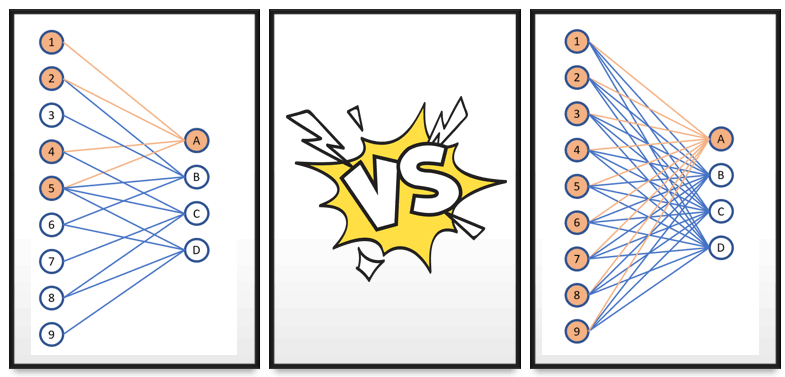
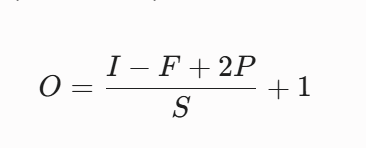
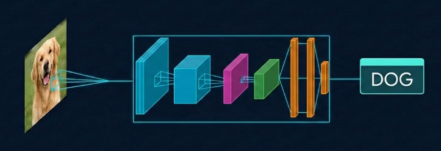
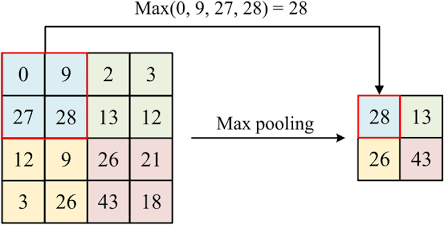
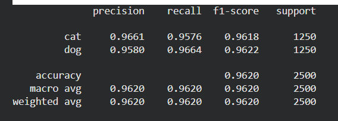

# Convolutional Neural Networks (CNNs)

While standard Artificial Neural Networks (ANNs) are highly effective for tabular data, they struggle when applied to high-dimensional spatial data such as images. The fundamental issue lies in the requirement to flatten input data into a 1D vector. When a 2D image is flattened, the vital spatial relationships between adjacent pixels are destroyed. Furthermore, connecting every pixel to every neuron in subsequent hidden layers (dense connections) results in a parameter explosion, leading to exorbitant computational costs and a high risk of overfitting.

To address these limitations, Convolutional Neural Networks (CNNs) were developed. CNNs are specifically designed to process data with a known grid-like topology, preserving spatial structure through localized connections and shared weights. A standard CNN architecture is constructed from three primary types of layers: Convolutional, Pooling, and Fully Connected (where normal ANN shines again)

## The Convolutional Layer (CONV): Feature Extraction

The Convolutional layer is the core building block of a CNN. Instead of dense connections, this layer utilizes a set of learnable filters (or kernels). These filters act as feature detectors, scanning across the input volume to identify local patterns such as edges, textures, and eventually complex shapes. The output O of this layer is called a feature map, or activation map.

The operation involves computing the dot product between the filter and a localized region of the input. This process is governed by three key hyperparameters:

- Kernel Size ($F$): The spatial dimensions of the filter (e.g., $3 \times 3$).

- Stride ($S$): The step size the filter takes as it slides across the input. A larger stride results in a smaller output spatial dimension.

- Padding ($P$): The addition of zero-value pixels to the borders of the input. "Valid" convolution uses no padding, resulting in a shrinking spatial dimension, while "Same" convolution adds enough padding to preserve the original spatial dimensions. There is also "Full" padding that ensure the edge pixel is also fulled observed by the filters, but it is not often used in image processing

The spatial dimensions of the resulting output feature map can be mathematically determined using the following formula, where $I$ represents the input dimension:

## Non-Linearity: Activation Functions

A network constructed solely of linear convolutional operations would remain a linear model, incapable of learning complex, real-world data distributions. To introduce non-linearity, an activation function is applied immediately after every convolution operation.

The Rectified Linear Unit (ReLU), defined mathematically as $f(x) = \max(0, x)$, is the standard activation function in modern CNNs. It replaces all negative pixel values in the feature map with zero. ReLU is heavily favored due to its computational efficiency and its ability to mitigate the vanishing gradient problem during backpropagation, which plagued earlier functions like the Sigmoid curve.

## The Pooling Layer (POOL): Dimensionality Reduction

To manage computational complexity and extract the most salient features, CNNs intersperse Convolutional layers with Pooling layers. Pooling performs non-linear downsampling, reducing the spatial dimensions (width and height) of the feature map while keeping the depth (number of channels) constant.

While Average Pooling calculates the mean of a region, Max Pooling is the dominant technique. By extracting only the maximum value within a defined window (e.g., a $2 \times 2$ window with a stride of 2), Max Pooling not only reduces dimensions but also provides spatial translation invariance. This crucial property ensures that the network can still recognize a feature even if its position within the image shifts slightly.

## The Fully Connected Layer (FC): Classification

After the image data has passed through multiple CONV and POOL layers, the network has learned a complex hierarchy of spatial features. To make a final classification, this multi-dimensional feature map must be transitioned back into a format suitable for standard classification algorithms.

The final 3D feature map is flattened into a 1D vector. This vector is then fed into one or more standard dense, Fully Connected layers. These layers aggregate the high-level features learned by the convolutional base and perform the final classification reasoning. The terminal layer typically employs a Softmax activation function, which normalizes the output into a probability distribution across the target classes.

## Application in this project

We implement a custom CNN from scratch using PyTorch to solve a binary image classification task (Dog vs. Cat). The architecture was designed to optimize feature extraction while strictly controlling the parameter count to prevent overfitting.

### Data Preprocessing and Augmentation

Robust data pipelines are critical for the generalization of deep learning models. The input images were standardized to a resolution of $224 \times 224$ pixels. To ensure numerical stability during gradient descent, all inputs were normalized using standard ImageNet statistics (Mean: [0.485, 0.456, 0.406], Standard Deviation: [0.229, 0.224, 0.225]).

During the training phase, data augmentation was applied to artificially expand the dataset and improve the model's resilience to varying inputs. The augmentation pipeline included:

- Random Resized Cropping: To force the network to recognize partial features of the animals.

- Random Horizontal Flipping: To ensure directional invariance.

- Color Jittering: Adjusting brightness, contrast, and saturation by 20% to reduce reliance on specific lighting conditions.

## Custom Convolutional Architecture

The network avoids the aggressive spatial downsampling seen in our first-attempt architectures. Instead, it utilizes four sequential convolutional blocks. Each block contains two stacked convolutional layers, each using a $3 \times 3$ kernel, a stride of 1, and a padding of 1, and each immediately followed by Batch Normalization and a ReLU activation. Stacking two convolutions per block deepens feature extraction at a given resolution, while the stride-1, padding-1 configuration preserves the spatial dimensions during the convolution operations themselves. The Batch Normalization layers standardize the activations of each mini-batch, stabilizing and accelerating training while also acting as a mild regularizer. Spatial reduction is delegated entirely to a $2 \times 2$ Max Pooling layer applied at the end of each block.

The network progressively increases the depth of the feature maps as the spatial dimensions decrease, following a channel progression of $32 \rightarrow 64 \rightarrow 128 \rightarrow 256$.

By the end of the fourth block, the original $224 \times 224 \times 3$ input image is transformed into a highly abstract feature map with dimensions of $14 \times 14 \times 256$.

## Global Average Pooling (GAP) and Classification

A major architectural divergence from traditional CNNs (which typically flatten the final feature map into a massive 1D vector) is the implementation of Global Average Pooling (GAP).

Instead of flattening the $14 \times 14 \times 256$ tensor—which would result in 50,176 features and millions of parameters in the subsequent dense layer—GAP calculates the spatial average of each of the 256 channels. This operation yields a compact $1 \times 1 \times 256$ vector. This design choice is parameter-free, significantly reduces the computational footprint, and acts as a strong structural regularizer against overfitting.

The resulting 256-dimensional vector is passed through a Fully Connected bottleneck layer of 128 neurons (activated by ReLU). To further mitigate overfitting, a Dropout layer is applied with a probability of $p=0.4$, zeroing out random neuron activations during training. A final linear transformation maps the data to the two target classes. In total, this architecture contains only about 1.2 million trainable parameters—remarkably compact for a model reaching this level of accuracy.

## Optimization and Training Dynamics

The model was optimized using the Adam algorithm with an initial learning rate of $1 \times 10^{-3}$ and a weight decay (L2 regularization) of $1 \times 10^{-4}$. To ensure the model converged effectively, a dynamic learning rate scheduler (ReduceLROnPlateau) was employed, configured to halve the learning rate if the validation loss failed to improve for two consecutive epochs.During the 25-epoch training cycle, model checkpointing was utilized. The state dictionary was captured at the epoch yielding the highest validation accuracy, ensuring that the final evaluated model represented the optimal set of weights rather than an overfitted end-state.

## Result 

Accuracy/loss curves when training/validating:

Confusion matrix:

Other metrics:

