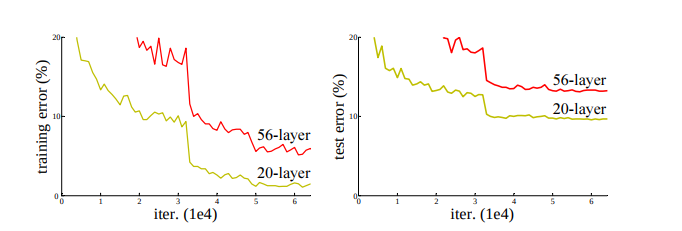
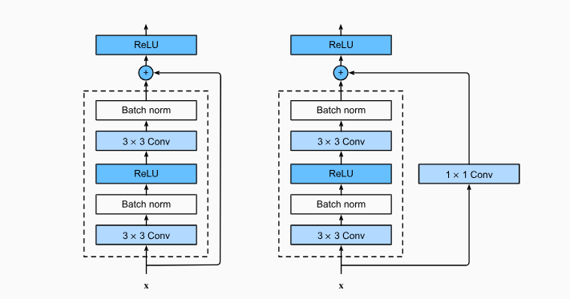
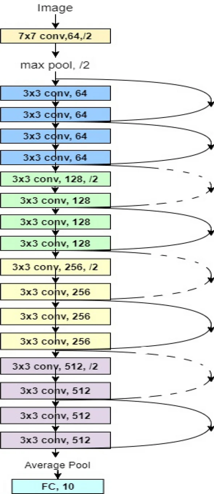
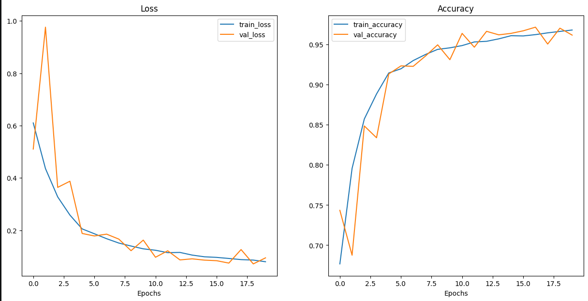
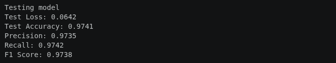
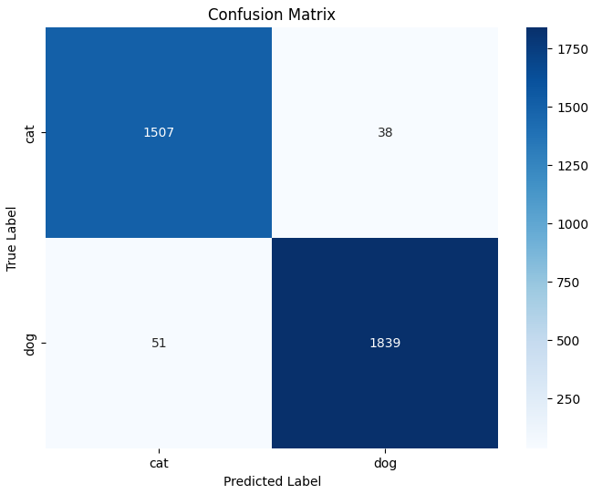

# 1, Limitation of CNN 
## Is a Deeper Network Always Better?
- Shallow network architectures are generally limited to learning low-level, surface features. 
- If we use deep network 
    - Early Layers: Learn basic, low-level structural elements such as lines, edges, and contrast boundaries.
    - Intermediate Layers: Form mid-level features by combining lower-level primitives into distinct object parts 
    - Deep Structural Layers: Aggregate part-based representations to high-level concepts.
- => Theoretical, Increasing network depth enriches the model's capacity to extract hierarchical features, leading to a more profound and comprehensive understanding of image .

## Problem of deep CNN 
### Vanishing gradient 
- During backpropagation, the loss signal is propagated from the output layer back to the initial layers via the chain rule. This mathematically translates into a sequence of continuous matrix multiplications involving the weights and activation function derivatives.
- Consequence: When these derivative values are bounded below 1.0 (e.g., when using classic activations like Sigmoid/Tanh), multiplying them continuously across dozens of layers causes the gradient magnitude to decrease exponentially. The gradients may approach zero by the time they reach the early layers => the initial layers fail to update their weights .
- In our previous CNN model, we use Batch Normalization and ReLU activations between the convolutional layers; therefore, it is inherently robust against the vanishing gradient problem.
### Degradation 
- When continuing to increase the network depth past a threshold limit, the system's accuracy begins to saturate and then degrades very rapidly.
- The degradation problem is not caused by overfitting. Visual proof shows that an excessively deep network (a 56-layer net) yields higher errors on both the training set (Training error) and the testing set (Testing error) compared to a shallower network (a 20-layer net)

- Every time an image matrix passes through a convolutional layer and a ReLU function, the data is transformed. When force the data to pass through 30 to 50 consecutive convolutional layers, the features of the image is transformed too much, leading to the original information becoming distorted and noisy. The deep layers at the back lose direction and cause the training error (Training Error).

# 2 , resNet 
- ResNet (Residual Network) was introduced in 2015 by Kaiming He and his team at Microsoft Research in their seminal paper, "Deep Residual Learning for Image Recognition." The architecture revolutionized deep learning by winning first place in all tracks of the ILSVRC and COCO 2015 competitions, providing a breakthrough solution to train ultra-deep neural networks.
- This is considered one of the best model for image classification problem
## Structure 
- The structure of ResNet is built upon dividing the network into smaller residual blocks (Residual Blocks), where each block consists of several convolutional layers along with a shortcut connection that links the input directly to the output of the block.
 
- Structure of a residual block is like this : 

- Output feature maps of block : **y = F(x, {W_i}) + x**
- Where :
    - *x* is input feature maps of block 
    - *F*(*x*, {*W_i*}) represent the transformation of x through convolution layers 

## Operation Principle 
- The operating principle of ResNet is based on the fact that instead of directly learning the mapping function *H*(*x*), the model will learn a residual function *F*(*x*) = *H*(*x*) - *x*. After that, the output of the model will be:

> **H(x) = F(x) + x**

### Key Advantages Compared to CNN
#### Solving the Degradation Phenomenon and the Depth Problem

- By using the formula *H*(*x*) = *F*(*x*) + *x*, the output already contains the baseline *x*, so the convolutional layers only need to learn the residual part *F*(*x*). Visually, we only have to learn the features (the perturbations) that need to be added to the previous feature maps.

- This ensures that a deep network will never have a worse training error than a shallow network. If a layer is redundant (meaning that keeping the input intact is the most optimal way), the network will automatically drive the weights to make *F*(*x*) = 0 to become a straight-through propagation. Driving *F*(*x*) = 0 in a residual network is significantly easier than forcing *H*(*x*) = *x* in a plain CNN .

- =>  Learning residual *F*(*x*) instead of *H*(*x*) making training process much faster => the network can be very deep( up to 1000 layers )

#### Solving gradient problem 
**Gradient in resnet ( in a Basic Residual Block )**
- **Step 1: Compute gradient for weights in filter (to update)**

> **∂L/∂W = (∂L/∂y) × (∂y/∂W)**

- 
    - where **∂L/∂y** is the gradient of the loss function with respect to the output of this block that is backpropagation from the behind block 
    - *y* = *F*(*x*) + *x* and **∂x/∂W = 0**, so :
    > **∂L/∂W = (∂L/∂y) × (∂F(x)/∂W)**

-   - Like normal CNN 

- **Step 2: Compute gradient for input x to pass to the previous block**

> **∂L/∂x = (∂L/∂y) × (∂y/∂x)**
-   - Cause *y* = *F*(*x*) + *x*, then :
> **∂L/∂x = (∂L/∂y) × (∂F(x)/∂x + 1) = ((∂L/∂y) × (∂F(x)/∂x)) + ∂L/∂y**

→ The difference is from step 2: even in the worst-case scenario—where all convolutional layers in Branch 1 have a derivative of zero (**∂F(x)/∂x = 0**)—the error propagation equation still preserves the remaining term:

> **∂L/∂x = 0 + ∂L/∂y = ∂L/∂y**

=> The gradient can't be down to 0 in back way 

# 3, ResNet for cat and dog problem 

- There are many resNet model that we can apply for this problem , here I choose **ResNet18** , which is suitable for our resource of GPU and amount of data 

## Structure of a residual block 

- Charateristic of a block contain:
    -  number of feature maps in of 1st conv layer 
    -  number of feature maps out of 1st conv layer(also number of in and out feature maps of 2nd layer )
    - stride of first conv layer (the second is 1)

- These hyperparamaters define the size , number of feature maps go through the network ( stride >1 can reduce the size of feature map)
- The size of *x* (number of feature maps , size of feature map) need to be the same as *F*(*x*) 
    - If the input *x* has difference size with *F*(*x*), we need to process *x* through a downsample (with 1x1 conv to change the size of *x*)

## ResNet 18 structure

| Layer Name | Internal Block Structure | Input Dimension (Size In) | Output Dimension (Size Out) | Input Channels (*C*_in) | Output Channels (*C*_out) | Downsample in Shortcut? |
| :--- | :--- | :---: | :---: | :---: | :---: | :---: |
| **Layer 0** (Stem) | Conv 7×7 (Stride 2) → MaxPool 3×3 (Stride 2) | 224 × 224 | 56 × 56 | 3 (RGB) | 64 | No (Plain Stem) |
| **Layer 1** | 2 × `BasicBlock` (Each with 2 × Conv 3×3) | 56 × 56 | 56 × 56 | 64 | 64 | **No** (Identity Mapping) |
| **Layer 2** | 2 × `BasicBlock` (Each with 2 × Conv 3×3) | 56 × 56 | 28 × 28 | 64 | 128 | **Yes** (Killed via Conv 1×1 at Block 1) |
| **Layer 3** | 2 × `BasicBlock` (Each with 2 × Conv 3×3) | 28 × 28 | 14 × 14 | 128 | 256 | **Yes** (Killed via Conv 1×1 at Block 1) |
| **Layer 4** | 2 × `BasicBlock` (Each with 2 × Conv 3×3) | 14 × 14 | 7 × 7 | 256 | 512 | **Yes** (Killed via Conv 1×1 at Block 1) |
| **Output Block**| Global Average Pooling → Flatten → Fully Connected (FC) | 7 × 7 | Flattened Vector | 512 | `num_classes` 2 |

# 4 , Training result 
- we train the resNet model with a dataset of 
    - Train size: 20000
    - Val size: 2500
    - Test size : 2500 

## Training process 

- The result model is from epoch 19 , which has the smallest val_loss

  - train_loss: 0.0692 
  - train_acc: 0.9721
  - val_loss: 0.0941 
  - val_acc: 0.9641

- The training process seem to be very success , better than the previous CNN model 
- We achive 96.41% accuracy of the validation test in the training process , although the training size is about 20000 train and 2500 val , much more small compare to massive ImageNet 
- Not Overfit or Underfit:  the training and validation curves track each other closely throughout the 20 epochs. The validation loss decreases consistently alongside the training loss without flattening out or rebounding upwards. This parallel progression indicates a healthy generalization state, meaning the model is learning meaningful patterns rather than memorizing the training data.

## Test Result 

- The error rate on the test set is very low (Test Loss: 0.0963, Test Accuracy: 96.33%). This result shows that the model has extremely good generalization capability and is not affected by overfitting at all, because the accuracy on the test set is equivalent to the accuracy on the previous validation set.

- The number of dog samples misclassified as cats (51 samples) is slightly higher than the number of cat samples misclassified as dogs (38 samples); however, this difference is negligible and does not cause a clear bias toward one side (class bias). 
- Overall, this is an excellent classification result for the Dog/Cat image classification problem using the ResNet architecture.

### **Conclusion**

- In conclusion, this part successfully developed and evaluated a ResNet-18 model for probelm of classification between dogs and cats. The experimental results demonstrate outstanding performance. The close alignment between the training, validation, and testing metrics proves that the network possesses excellent generalization capabilities without suffering from overfitting. This show the power of ResNet for image classification problem.
- ResNet-18 has delivered robust results but using deeper architectures such as ResNet-34 or ResNet-50 could potentially yield even higher classification accuracy. However, due to computational resource constraints, training these larger models was beyond the scope of this study.