# HOG FEATURE EXTRACTION AND LINEAR SVM
## 1\. Introduction
Before deploying deep feature-learning architectures like Convolutional Neural Networks, it is critical to establish a performance baseline using traditional Machine Learning methodologies. This baseline serves as a robust benchmark to evaluate the performance achieved by neural networks when processing highly unstructured image data. To accomplish this, this section utilizes the Histogram of Oriented Gradients for manual feature extraction, paired with a custom Linear Support Vector Machine optimized via Stochastic Gradient Descent.
## 2\. HOG Feature Extraction
A feature descriptor is a representation of an image or an image patch that simplifies the image by extracting useful information and throwing away extraneous information.

In the HOG feature descriptor, the distribution of directions of oriented gradients are used as features. Gradients of an image are useful because the magnitude of gradients is large around edges and corners ( regions of abrupt intensity changes ) and we know that edges and corners pack in a lot more information about object shape than flat regions.
### 2\.1 Data Preprocessing
Ÿ Grayscale Conversion: All input images from the Dogs vs. Cats dataset are converted from RGB to grayscale. This allows the algorithm to focus strictly on structural contours and lighting gradients rather than being distracted by variations in fur color.

Ÿ Dimensionality Standardization: Images are uniformly resized to a spatial resolution of 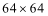 pixels. This guarantees that the resulting HOG descriptor maintains a fixed, uniform dimensionality for the linear classifier.

Instead of feeding raw pixel intensities into the model, the HOG descriptor analyzes the morphological structure of the object by capturing the distribution of intensity gradients. This transforms the  grayscale images into robust mathematical vectors through four computational stages
### 2\.2 Step 1: Calculate the Gradient Images
The algorithm first computes the horizontal  and vertical  gradients of the image by filtering it with 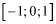 kernels. 

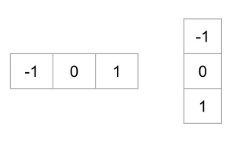

For every single pixel, the gradient magnitude 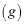 and the gradient direction 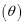 are calculated using the following equations:

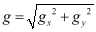		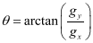

The figure below shows the gradients:

This gradient computation effectively removes a substantial amount of non-essential information. However, it preserves and highlights the critical structural outlines. By looking purely at the gradient magnitude image, one can still easily distinguish the silhouette of a dog or a cat.
### 2\.3 Step 2: Calculate Histograms of Gradients in 8x8 cells
The next step is to create a histogram of gradients. Rather than analyzing the entire image at once or looking at individual, noisy pixels, the image is divided into smaller 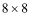 pixel cells. Calculating a histogram over an 8x8 patch makes the representation significantly more compact and highly robust to localized noise.

- 9-Bin Histogram Structure: Within each 8x8 cell, a 9-bin histogram is generated. We utilize unsigned gradients, meaning the angles are evaluated between 0 and 180 degrees. The bins are evenly spaced at 0, 20, 40, ..., 160 degrees.
- Proportional Voting Mechanism: Each pixel within the cell casts a vote to build this histogram. The bin selection is determined by the pixel's gradient direction (angle). The weight of the vote (the value added to the bin) is determined by the pixel's gradient magnitude.
- Splitting Votes: To avoid sudden quantization errors, if a pixel's angle falls exactly between two bins, its vote is split proportionally. Furthermore, because angles wrap around, a pixel with an angle of 165 degrees will proportionally split its vote between the 160-degree bin and the 0-degree bin.
### 2\.4 Step 3 Block Normalization 
Gradient magnitudes are highly sensitive to overall illumination and foreground-background contrast. To render the descriptor invariant to such lighting changes, the local cell histograms must be mathematically normalized.

- Block Grouping: The  pixel cells are grouped into larger 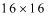 spatial blocks (each block containing 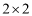 cells).
- Vector Concatenation and Normalization: The four 9-bin histograms within this block are concatenated into a single 36-dimensional vector 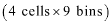. This vector is then mathematically normalized using the 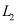-norm:

  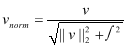

- Overlapping: These blocks overlap as they slide across the image with a stride of 8 pixels. Because of this overlapping block architecture, each individual cell contributes its histogram to multiple blocks, further increasing the robustness of the final feature vector against local variations.
### 2\.5 Step 4: Final Feature Vector Assembly
The final step in the HOG feature extraction pipeline is the construction of the ultimate feature vector, which will serve as the input for the Linear SVM classifier. This is achieved by flattening and concatenating all the - normalized blocks across the entire image into a single, one-dimensional array.

Given our standardized input image and the configured HOG parameters, the exact dimensionality of the final feature vector is calculated as follows:

- Image Dimensions:   pixels.
- Block Sliding: The  pixel blocks move across the image with a stride of 8 pixels.
- Horizontal and Vertical Blocks:

  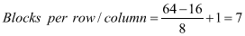

- Total Blocks: 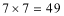 blocks per image.
- Features per Block: Each block contains 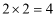 cells, and each cell has a 9-bin histogram. Thus, there are 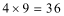 features per block.
- Final Vector Dimension: 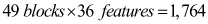 dimensions.

Consequently, every  grayscale image of a dog or cat is efficiently compressed into a robust, 1,764-dimensional feature space, balancing detail retention with computational efficiency.

The visulization of HOG can be seen as the following picture:

## 3\. Linear SVM implementation and Hyperparameter tuning
The 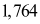-dimensional feature space serves as the input for the classification algorithm. Rather than utilizing pre-packaged optimization libraries, a linear SVM was constructed from scratch using NumPy.

We train the baseline HOG-SVM model with a dataset of:

- Train size: 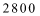 
- Val size: 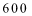 
- Test size:  
- Objective function: The model minimizes the Hinge Loss function combined with an  regularization penalty to prevent overfitting:

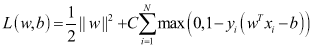

Optimization Algorithm: To find the global minimum of the objective function, the model utilizes Stochastic Gradient Descent (SGD). The weights 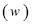 and bias 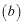 are iteratively updated per sample based on the calculated gradients, ensuring computational efficiency on the CPU.

Hyperparameter Grid Search: The learning rate 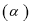 and the regularization parameter 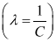  were strictly tuned on the validation set. We defined a search space of 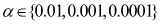 and 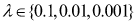 to discover the optimal point of convergence before the final evaluation.
## 4\. Experimental results
### 4\.1 Train and Validation Result
Through Grid Search on the Validation set, the model achieved its optimal convergence state.

|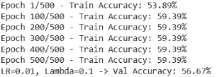|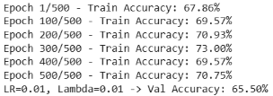|
| - | - |
|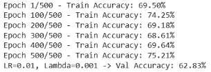|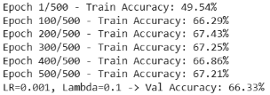|
|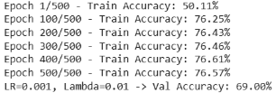|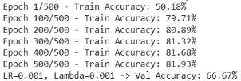|
|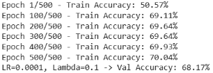|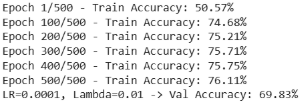|
|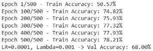||
The resulting model is configured with the optimal hyperparameters:

- Best Learning Rate (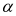):  
- Best Regularization Parameter (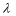): 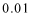 
- Best Validation Accuracy :  

After identifying the optimal hyperparameters 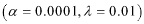, the baseline model was retrained on the combined Training and Validation dataset 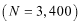 to maximize the learning capacity before the final evaluation. 

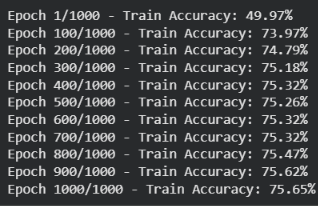

- Final Training Accuracy : 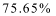 

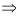 The training process demonstrates a solid baseline performance for traditional machine learning approaches.

 The validation accuracy indicates a healthy generalization state, proving that the HOG-SVM pipeline is extracting meaningful geometric patterns rather than memorizing the training data.
### 4\.2 Test result
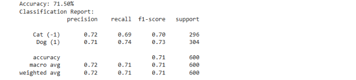

Ÿ The accuracy on the test set reached 71.50%. This result shows that the baseline model has a stable generalization capability and is not affected by severe overfitting, because the accuracy on the test set aligns reasonably well with the accuracy on the previous validation set.

Ÿ The number of cat samples misclassified as dogs (93 samples) is slightly higher than the number of dog samples misclassified as cats (78 samples); this difference highlights that the HOG descriptor struggles more with the highly deformable and non-rigid postures of felines compared to the distinct, angular skeletal structures of dogs.

Ÿ Overall, this is a credible baseline classification result for the Dog/Cat image classification problem using the traditional HOG-SVM architecture.
## Conclusion
Ÿ In conclusion, this part successfully developed and evaluated a baseline HOG-SVM model for the problem of classification between dogs and cats. The experimental results demonstrate a solid foundational performance. The close alignment between the training, validation, and testing metrics proves that the custom-built network possesses stable generalization capabilities without suffering from overfitting. This shows the fundamental value of traditional machine learning as a benchmark for image classification problems.

Ÿ The HOG-SVM model has delivered robust baseline results to compare with deep feature-learning architectures presented in this report. Due to the inherent limitations of manual feature extraction in handling complex geometric variations and background clutter, it is readily apparent that CNN, ANN, Resnet can produce a better performance.

