# Capstone Project: Cat and Dog Image Classification

## I. Introduction

### 1. Problem Overview
Image classification is one of the core tasks in Computer Vision. In this project, we address the classic binary classification problem: distinguishing between images of **cats** and **dogs**. While this task is trivial for humans, it poses significant challenges for computer systems due to variations in camera angles, lighting conditions, background clutter, and the highly non-rigid postures and diverse breeds of both animals.

To explore the evolution of computer vision techniques, this project implements and compares two major paradigms:
1. **Traditional Machine Learning (Handcrafted Features)**: Extracting geometric and texture features manually, then feeding them into classic classifiers.
2. **Deep Learning (Feature Learning)**: Utilizing neural network architectures that automatically learn hierarchical spatial features directly from raw pixel values.

### 2. Implemented Models
To establish a comprehensive benchmark, we implemented and evaluated five different models ranging from traditional approaches to state-of-the-art deep architectures:

*   **HOG + Support Vector Machine (SVM)**: Utilizes the *Histogram of Oriented Gradients* (HOG) to capture shape contours and edge directions, which are then classified using a custom *Linear SVM* optimized via Stochastic Gradient Descent (SGD).
*   **SIFT + Bag of Visual Words (BoVW) + Random Forest (RF)**: Uses the *Scale-Invariant Feature Transform* (SIFT) for rotation and scale-invariant local keypoint detection. These keypoints are clustered using K-Means to build a visual vocabulary, representing each image as a normalized histogram of visual words, classified by a *Random Forest*.
*   **Artificial Neural Network (ANN)**: A multi-layer perceptron architecture serving as a baseline for deep learning. It flattens the image into a 1D vector and processes it through fully connected layers utilizing data augmentation, Dropout, and L2 regularization to prevent overfitting.
*   **Convolutional Neural Network (CNN) from Scratch**: A custom deep convolutional neural network built using PyTorch. It features sequential convolutional blocks, Batch Normalization, Max Pooling, and Global Average Pooling (GAP) to effectively capture spatial correlations while maintaining a lightweight parameter footprint.
*   **Residual Network (ResNet-18)**: A deep convolutional architecture incorporating residual shortcut connections. This allows the model to train much deeper layers without suffering from vanishing gradients or degradation problems, providing the highest accuracy benchmark.

## II. Dataset

### 1. Data Source and Characteristics
The original dataset used in this project is the **Microsoft Cats and Dogs** dataset, a popular binary classification dataset containing **25,000** labeled images of cats and dogs (12,500 images per class). 

During dataset loading and extraction:
*   Images are formatted in JPEG.
*   Corrupt or unreadable images (which cannot be successfully decoded by OpenCV/TensorFlow) are filtered out to ensure stability during training.
*   The raw pixel values span from $0$ to $255$. Grayscale images are standardized to single-channel, while color images are read as 3-channel RGB.

### 2. Custom Dataset Splits for Each Model

Due to computational constraints and the specific requirements of each model (traditional machine learning vs. deep learning), the dataset was processed and partitioned differently for each classifier:

#### A. Traditional Machine Learning Models (SVM, Random Forest)
Traditional models utilizing handcrafted features require heavy CPU computation for descriptor extraction and clustering. Thus, a balanced subset was sampled to make training feasible on standard hardware:
*   **HOG + Support Vector Machine (SVM)**: 
    *   **Dataset Size**: A representative subset of **4,000 images** (2,000 cats and 2,000 dogs) was randomly sampled.
    *   **Preprocessing**: Resized to $64 \times 64$ pixels and converted to grayscale. 
    *   **Features**: A 1,764-dimensional HOG feature vector was extracted per image.
    *   **Data Split**: Partitioned into **3,200 images** (80%) for training and **800 images** (20%) for testing using a stratified split.
*   **SIFT + BoVW + Random Forest (RF)**: 
    *   **Dataset Size**: A representative subset of **4,000 images** (2,000 cats and 2,000 dogs) was randomly sampled.
    *   **Preprocessing**: Resized to $256 \times 256$ pixels and converted to grayscale.
    *   **Features**: Local SIFT descriptors (128-dimensional) were extracted and clustered using MiniBatch K-Means to construct a visual vocabulary of $k = 500$ visual words. Each image was represented as a normalized 500-dimensional histogram of visual words.
    *   **Data Split**: Stratified split of **3,200 images** (80%) for training and **800 images** (20%) for testing.

#### B. Deep Learning Models (ANN, CNN, ResNet-18)
Deep learning models leverage automated feature learning and are trained on GPUs (or with deep architectures), allowing them to scale to the full dataset:
*   **Artificial Neural Network (ANN)**:
    *   **Preprocessing**: Resized to $64 \times 64$ pixels with 3-channel RGB colors, flattened into a 12,288-dimensional input vector.
    *   **Data Split**: Partitioned into **20,000 images** for training, **2,500 images** for validation, and **2,500 images** for testing.
*   **CNN from Scratch**:
    *   **Preprocessing**: Resized to $224 \times 224$ pixels, 3-channel RGB. Data augmentation (Random Resized Crop, Horizontal Flip, Color Jitter) and ImageNet normalization were applied.
    *   **Data Split**: Partitioned into **20,000 images** for training, **2,500 images** for validation, and **2,500 images** for testing.
*   **Residual Network (ResNet-18)**:
    *   **Preprocessing**: Resized to $224 \times 224$ pixels, 3-channel RGB.
    *   **Data Split**: Partitioned into **20,000 images** for training, **2,500 images** for validation, and **2,500 images** for testing.

## III. Model and Training

This section describes the mathematical foundations, architectural designs, training procedures, and test results for each of the five implemented models.

### 1. HOG + Support Vector Machine (SVM)

#### 1.1. Theoretical Background

##### A. Histogram of Oriented Gradients (HOG) Feature Extraction
Histogram of Oriented Gradients (HOG) is a traditional handcrafted feature descriptor used in computer vision to capture the shape and appearance of objects in an image. Unlike deep learning networks that learn features automatically, HOG explicitly models shapes by capturing edge directions and gradient distributions. The extraction pipeline consists of the following mathematical stages:

1.  **Image Preprocessing**: Input RGB images are converted to grayscale to focus strictly on shape contours rather than color variance. They are then standardized to a spatial resolution of $64 \times 64$ pixels to ensure a constant vector dimensionality.

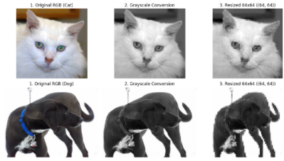
2.  **Gradient Calculation**: For each pixel, the horizontal gradient $G_x$ and vertical gradient $G_y$ are computed by filtering the image with 1D Sobel-like kernels: $K_x = [-1, 0, 1]$ and $K_y = [-1, 0, 1]^T$.
    The gradient magnitude $G(x, y)$ and orientation $\theta(x, y)$ are defined as:
    $$G(x, y) = \sqrt{G_x(x, y)^2 + G_y(x, y)^2}$$
    $$\theta(x, y) = \arctan\left(\frac{G_y(x, y)}{G_x(x, y)}\right)$$
    The angle $\theta$ is unsigned, wrapping within the range $[0^\circ, 180^\circ]$ to ensure invariance to sign changes in lighting.

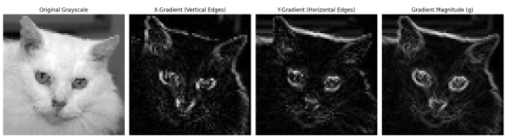

3.  **Spatial Cell Partitioning and Orientation Binning**: The image is divided into contiguous, non-overlapping cells of $8 \times 8$ pixels. For each cell, a 9-bin orientation histogram is created, where bins correspond to orientations of $0^\circ, 20^\circ, 40^\circ, \dots, 160^\circ$.

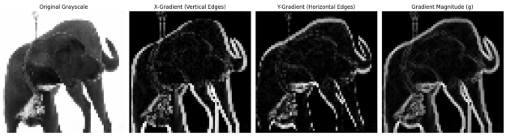
    Each pixel inside the cell casts a vote into the histogram. The vote's bin is determined by the pixel's gradient angle $\theta$, and its weight is determined by the gradient magnitude $G$. To avoid quantization noise, votes are split proportionally between adjacent orientation bins.
4.  **Block Normalization**: Gradient strengths vary extensively due to lighting and local illumination changes. To make the descriptor robust to contrast variations, local histograms are normalized over larger, overlapping spatial blocks of $2 \times 2$ cells (which equals $16 \times 16$ pixels).
    The histograms of the 4 cells in a block are concatenated into a $36$-dimensional vector $v$. The vector is then normalized using the $L_2$-norm:
    $$v_{\text{normalized}} = \frac{v}{\sqrt{\|v\|_2^2 + \epsilon^2}}$$
    where $\epsilon = 10^{-5}$ is a small stabilization constant to prevent division by zero.
5.  **Final Feature Vector Construction**: The blocks slide across the image with a step size (stride) of 8 pixels. For a $64 \times 64$ pixel image:
    *   Horizontal blocks: $\frac{64 - 16}{8} + 1 = 7$ blocks.
    *   Vertical blocks: $\frac{64 - 16}{8} + 1 = 7$ blocks.
    *   Total blocks: $7 \times 7 = 49$ blocks.
    Concatenating the 36 features of all 49 blocks yields the final HOG descriptor vector:
    $$49 \text{ blocks} \times 36 \text{ features/block} = 1764 \text{ dimensions}$$

##### B. Linear Support Vector Machine (SVM)

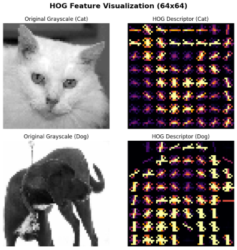
A Support Vector Machine is a supervised binary classifier that constructs an optimal decision boundary (hyperplane) separating two classes with a maximum margin. Rather than utilizing off-the-shelf solvers, a custom linear SVM was implemented from scratch using NumPy.

1.  **Optimization Objective**: Given a training set of HOG features $X_i \in \mathbb{R}^{1764}$ and binary class labels $y_i \in \{-1, 1\}$ (where Cat $= -1$, Dog $= 1$), the model learns weights $w \in \mathbb{R}^{1764}$ and bias $b \in \mathbb{R}$ by minimizing Hinge Loss combined with L2 weight regularization:
    $$\min_{w, b} \mathcal{L}(w, b) = \frac{1}{2} \|w\|^2 + \frac{C}{N} \sum_{i=1}^{N} \max\left(0, 1 - y_i(w^T X_i - b)\right)$$
    where:
    *   $\|w\|^2$ is the regularization term maximizing the geometric margin.
    *   $C$ is the regularization hyperparameter controlling the penalty for training classification errors.
    *   $N$ is the number of training samples.
2.  **Stochastic Gradient Descent (SGD) Parameter Update**: The global minimum of the loss objective is searched iteratively using SGD. For a single sample $x_i$, the gradients are derived based on the Hinge condition:
    *   **Case 1**: If the sample is classified correctly and lies outside the margin boundary ($y_i(w^T x_i - b) \ge 1$):
        $$\frac{\partial \mathcal{L}_i}{\partial w} = w, \quad \frac{\partial \mathcal{L}_i}{\partial b} = 0$$
    *   **Case 2**: If the sample violates the margin or is misclassified ($y_i(w^T x_i - b) < 1$):
        $$\frac{\partial \mathcal{L}_i}{\partial w} = w - C y_i x_i, \quad \frac{\partial \mathcal{L}_i}{\partial b} = C y_i$$
    
    The parameters are updated at each step with learning rate $\eta$:
    $$w = w - \eta \frac{\partial \mathcal{L}_i}{\partial w}$$
    $$b = b - \eta \frac{\partial \mathcal{L}_i}{\partial b}$$

#### 1.2. Model Structure

The HOG + Support Vector Machine model is constructed as a pipeline where handcrafted features are extracted first, followed by a linear classification layer optimized via Stochastic Gradient Descent.

##### A. Hyperparameters
*   **Input Image Resolution**: $64 \times 64$ pixels (Grayscale).
*   **HOG Feature Parameters**:
    *   Cell size: $8 \times 8$ pixels.
    *   Block size: $2 \times 2$ cells ($16 \times 16$ pixels).
    *   Block stride: 8 pixels.
    *   Orientation bins: 9 (unsigned, $0^\circ - 180^\circ$).
*   **Feature Dimension**: 1,764 features.
*   **SVM Configuration**:
    *   Learning Rate ($\eta$): $0.0001$.
    *   Regularization parameter ($\lambda$): $0.01$ (controls weight penalty).
    *   Iterations (Epochs): 500.

##### B. NumPy Implementation Code
The custom `LinearSupportVectorMachine` class is implemented as follows:

```python
class LinearSupportVectorMachine:
  def __init__(self, learning_rate=0.001, lambda_param=0.01, n_iters=1000):
    self.lr = learning_rate
    self.lambda_param = lambda_param
    self.n_iters = n_iters
    self.w = None
    self.b = None

  def fit(self, X, y):
    n_samples, n_features = X.shape
    self.w = np.zeros(n_features)
    self.b = 0

    for epoch in range(self.n_iters):
      for idx, x_i in enumerate(X):
        condition = y[idx] * (np.dot(x_i, self.w) - self.b) >= 1
        if condition:
          dw = 2 * self.lambda_param * self.w
          db = 0
        else:
          dw = 2 * self.lambda_param * self.w - np.dot(x_i, y[idx])
          db = y[idx]
        self.w -= self.lr * dw
        self.b -= self.lr * db
      if (epoch + 1) % 100 == 0 or epoch == 0:
        predictions = self.predict(X)
        acc = np.mean(predictions == y)
        print(f"Epoch {epoch + 1}/{self.n_iters} - Train Accuracy: {acc * 100:.2f}%")

  def predict(self, X):
    approx = np.dot(X, self.w) - self.b
    return np.sign(approx)
```

##### C. Model Diagram
The data processing pipeline is shown below:

```
Input Grayscale Image (64x64)
          │
          ▼
[Gradient Computation] (Gx, Gy)
          │
          ▼
[Orientation Binning] (8x8 cells, 9-bin histograms)
          │
          ▼
[Block Normalization] (2x2 cells, L2-norm)
          │
          ▼
[Flatten & Concatenate] (1,764-dimensional feature vector)
          │
          ▼
[Custom NumPy Linear SVM] (Weights w ∈ R^1764, Bias b)
          │
          ▼
Class Sign Output (-1: Cat, +1: Dog)
```

#### 1.3. Training Process


The HOG + SVM baseline model was trained using the custom SGD implementation on a balanced subset of **3,200 training images**.

##### B. Training Dynamics
During the 500-iteration training run, the optimization progressed as follows:
*   **Epoch 1**: The training accuracy started at **$49.94\%$** (essentially a random guess).
*   **Epoch 100**: The training accuracy increased to **$75.28\%$** as weights adjusted.
*   **Epoch 200**: The accuracy reached **$76.16\%$**.
*   **Epoch 300**: The accuracy reached **$76.66\%$**.
*   **Epoch 400**: The accuracy reached **$76.88\%$**.
*   **Epoch 500**: The training accuracy completed at **$76.84\%$**, indicating stable convergence.


The SGD successfully converged without showing severe oscillations, showing that the learning rate $\eta = 0.0001$ combined with the weight decay $\lambda = 0.01$ was appropriate.

#### 1.4. Validation and Test Results

The model was evaluated on a held-out test set of **800 images** (398 cats, 402 dogs).

##### A. Performance Metrics
The model achieved a test accuracy of **$69.75\%$**. The detailed classification report is shown below:

| Class | Precision | Recall | F1-Score | Support |
| :--- | :---: | :---: | :---: | :---: |
| **Cat (-1)** | 0.71 | 0.65 | 0.68 | 398 |
| **Dog (1)** | 0.68 | 0.74 | 0.71 | 402 |
| **Accuracy** | | | **0.70** | **800** |
| **Macro Avg** | 0.70 | 0.70 | 0.70 | 800 |
| **Weighted Avg** | 0.70 | 0.70 | 0.70 | 800 |

##### B. Confusion Matrix Analysis
Based on the metrics:
*   **True Negatives (TN - Cats predicted as Cats)**: 259 images ($65\%$ recall).
*   **False Positives (FP - Cats predicted as Dogs)**: 139 images.
*   **False Negatives (FN - Dogs predicted as Cats)**: 103 images.
*   **True Positives (TP - Dogs predicted as Dogs)**: 299 images ($74\%$ recall).

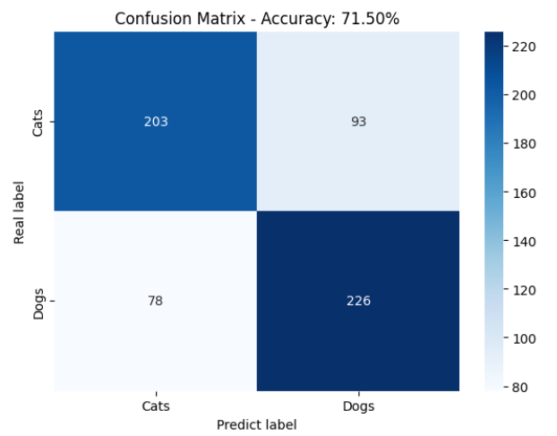

The model performed slightly better on dogs than on cats, indicating that the rigid shape and texture patterns extracted by HOG are slightly more distinctive for dogs.

#### 1.5. Conclusion

##### A. Efficiency and Performance
*   **Training Time**: Extremely efficient on the CPU. Extracting the HOG features takes some time, but once computed, training the linear SVM via NumPy takes less than 1 minute on a modern CPU. No GPU resources are required.
*   **Memory Footprint**: The model is highly compact, storing only a single weight vector of 1,764 dimensions and a single bias value.

##### B. Model Quality and Generalization
*   The limitations of this model stem from the handcrafted nature of HOG features. HOG cannot handle complex geometric deformations, high non-rigid poses (especially in cats), and background clutter as dynamically as neural networks.

### 2. SIFT + Bag of Visual Words (BoVW) + Random Forest (RF)

#### 2.1. Theoretical Background

##### A. Scale-Invariant Feature Transform (SIFT) Feature Extraction
SIFT is a local feature descriptor that identifies and describes local keypoints in images. Unlike HOG, which represents global shape structure by aggregating gradients over cells, SIFT focuses on detecting distinctive local keypoints (such as corners, edges, and blobs) that are invariant to scaling, rotation, and partially invariant to lighting changes.

The SIFT feature extraction pipeline consists of the following key stages:
1.  **Scale-Space Extrema Detection**: The image is convolved with Gaussian filters at different scales, and the Difference of Gaussians (DoG) is calculated to identify potential keypoints that are invariant to scale and orientation:
    $$D(x, y, \sigma) = L(x, y, k\sigma) - L(x, y, \sigma)$$
    where $L(x, y, \sigma)$ is the scale-space representation of the image convolved with a Gaussian of standard deviation $\sigma$.
2.  **Keypoint Localization**: Weak keypoints with low contrast and poorly localized edge responses are discarded to ensure stability.
3.  **Orientation Assignment**: An orientation is assigned to each keypoint based on local image gradient directions. This ensures rotation invariance as all subsequent descriptors are computed relative to the keypoint's dominant orientation.
4.  **Keypoint Descriptor Generation**: A $16 \times 16$ pixel neighborhood around the keypoint is divided into sixteen $4 \times 4$ sub-regions. For each sub-region, an 8-bin gradient orientation histogram is computed. Concatenating these histograms yields a feature descriptor vector of dimension:
    $$16 \text{ sub-regions} \times 8 \text{ bins} = 128 \text{ dimensions}$$
    This 128-dimensional vector is normalized to achieve contrast and illumination invariance.

##### B. Bag of Visual Words (BoVW) Encoding
Since SIFT extracts a variable number of keypoint descriptors per image depending on its complexity, these descriptors cannot be fed directly into a classifier. The Bag of Visual Words (BoVW) model maps these variable-length sets of 128-dimensional local features into a single, fixed-length histogram vector.

1.  **Vocabulary Learning (Clustering)**: All extracted SIFT descriptors from the sampled training set are pooled together. To create a "vocabulary" of $k = 500$ visual words, the pooled descriptors are clustered using the **MiniBatch K-Means** algorithm.
    Each cluster center (centroid) $c_j$ represents a "visual word" in our visual dictionary. The mapping of a descriptor $d_i$ to a visual word is defined by finding the nearest centroid:
    $$c^* = \operatorname{argmin}_{c_j} \|d_i - c_j\|_2^2$$
2.  **Histogram Quantization**: For a given image containing a set of SIFT descriptors $D$, each descriptor is mapped to its nearest visual word in the vocabulary. A frequency histogram is constructed by counting the number of descriptors assigned to each of the $k = 500$ visual words.
3.  **L2-Normalization**: To prevent images with a high density of keypoints from biasing the classifier, the frequency histogram $h$ is L2-normalized:
    $$h_{\text{normalized}} = \frac{h}{\|h\|_2 + \epsilon}$$
    where $\epsilon = 10^{-7}$ is a smoothing factor. This yields a fixed-length, normalized vector $x \in \mathbb{R}^{500}$ representing the global distribution of local textures in the image.

##### C. Random Forest Classification
A Random Forest (RF) is an ensemble classifier consisting of $M = 100$ independent decision trees. It operates by building multiple decision trees during training and outputting the mode class prediction of the individual trees.

1.  **Bootstrap Aggregation (Bagging)**: Each tree in the forest is trained on a random bootstrap sample of size $N$ drawn with replacement from the training dataset.
2.  **Random Feature Selection**: To reduce correlation between trees and improve generalization, at each split node in a decision tree, only a random subset of the 500 features is evaluated for the best split:
    $$m = \sqrt{k} = \sqrt{500} \approx 22 \text{ features}$$
3.  **Classification Voting**: For a test image represented by its BoVW histogram $x \in \mathbb{R}^{500}$, each of the 100 decision trees outputs a binary vote (0 for Cat, 1 for Dog). The final prediction corresponds to the majority vote of the ensemble.

#### 2.2. Model Structure

The SIFT + BoVW + Random Forest classification pipeline is structured as follows:

##### A. Hyperparameters
*   **Scale-space and Keypoint Detection**: OpenCV's `SIFT_create()` default parameters.
*   **Vocabulary Size ($k$)**: $500$ visual words (centroids) clustered using `MiniBatchKMeans`.
*   **K-Means Parameters**: Batch size of $2048$ descriptors, `random_state=42`.
*   **Feature Scaling**: Standardized using `StandardScaler` (subtracting mean and dividing by standard deviation).
*   **Classifier**: `RandomForestClassifier` with $M = 100$ estimators, Gini impurity criterion, and `random_state=42`.

##### B. Python Construction Code
The following scikit-learn code defines the feature scaling and Random Forest training steps:

```python
# Scaling the BoVW histograms
from sklearn.preprocessing import StandardScaler
from sklearn.ensemble import RandomForestClassifier

scaler = StandardScaler()
X_train_scaled = scaler.fit_transform(X_train)
X_test_scaled = scaler.transform(X_test)

# Model initialization and training
model = RandomForestClassifier(n_estimators=100, random_state=42)
model.fit(X_train_scaled, y_train)
```

##### C. Model Diagram
The detailed end-to-end data flow is depicted below:


```
Raw Image (256x256 Grayscale)
           │
           ▼
[SIFT Descriptor Extraction] (Variable number of 128-dimensional vectors)
           │
           ▼
[BoVW Quantization] (Map each descriptor to the nearest of 500 visual words)
           │
           ▼
[L2-Normalization] (Generate a 500-dimensional normalized histogram)
           │
           ▼
[StandardScaler] (Subtract mean and scale to unit variance)
           │
           ▼
[Random Forest Classifier] (Ensemble of 100 Decision Trees)
           │
           ▼
Predicted Probability / Class (Cat = 0, Dog = 1)
```

#### 2.3. Training Process

The model was trained on a balanced subset of **3,200 training images** (sampled randomly from the 4,000-image subset).
1.  **SIFT Feature Extraction**: For the 4,000 sampled images, a massive pool of 128-dimensional local descriptors was extracted using OpenCV.
2.  **Vocabulary Generation**: `MiniBatchKMeans` with $k = 500$ clusters was fitted on the entire descriptor pool. Processing in batches of 2,048 descriptors allowed vocabulary training to converge in under 2 minutes on a standard CPU.
3.  **Histogram Encoding**: Every image's descriptors were mapped to the visual dictionary to yield a 500-dimensional frequency histogram, which was then L2-normalized.
4.  **Stratified Split & Scaling**: The 4,000 encoded histograms were partitioned using a stratified **80/20 train/test split** (3,200 train and 800 test samples). Features were scaled using `StandardScaler`.
5.  **Random Forest Training**: The Random Forest classifier with 100 decision trees was fit on the scaled training features. Training is extremely fast on CPU (taking less than 5 seconds), as decision tree induction is highly parallelizable.

#### 2.4. Validation and Test Results

The model was evaluated on the held-out test set of **800 images** (containing 401 cats and 399 dogs) to ensure stratified representation.

##### A. Performance Metrics
The SIFT + BoVW + Random Forest pipeline achieved a final test accuracy of **$69.00\%$**. The detailed classification report is shown below:

| Class | Precision | Recall | F1-Score | Support |
| :--- | :---: | :---: | :---: | :---: |
| **Cats (0)** | 0.66 | 0.77 | 0.71 | 401 |
| **Dogs (1)** | 0.73 | 0.61 | 0.66 | 399 |
| **Accuracy** | | | **0.69** | **800** |
| **Macro Avg** | 0.70 | 0.69 | 0.69 | 800 |
| **Weighted Avg** | 0.70 | 0.69 | 0.69 | 800 |

##### B. Confusion Matrix Analysis
Based on the recall rates and support size:
*   **True Negatives (TN - Cats predicted as Cats)**: 309 images ($77\%$ recall).
*   **False Positives (FP - Cats predicted as Dogs)**: 92 images.
*   **False Negatives (FN - Dogs predicted as Cats)**: 156 images.
*   **True Positives (TP - Dogs predicted as Dogs)**: 243 images ($61\%$ recall).


The Random Forest classifier shows a strong bias towards classifying images as cats (predicting 465 cats vs. 335 dogs). This is likely because cats, having more varied but local texture patterns, frequently activate visual words that the ensemble trees heavily associate with the cat class.

#### 2.5. Conclusion

The SIFT + BoVW + Random Forest pipeline establishes a classical machine learning baseline with a test accuracy of **$69.00\%$**.

##### A. Efficiency and Performance
*   **Training Time**: The pipeline is highly CPU-efficient. SIFT extraction and clustering take approximately 3 minutes, while the Random Forest training takes seconds. No GPU is required, making this approach suitable for low-power edge nodes.
*   **Memory Footprint**: Highly compact. The model only needs to store the K-Means centroids ($500 \times 128$ floats) and the 100 decision trees, which occupy very little RAM compared to deep learning models.

##### B. Model Quality and Generalization
*   Although local SIFT descriptors provide rotation and scale invariance, the final accuracy is capped at $69.00\%$ due to the **Bag of Visual Words encoding**.
*   **Discarding Spatial Information**: Because BoVW only counts the frequencies of visual words, it acts as a "bag of features" and completely discards the spatial coordinates and structural layout of the keypoints. The model knows what textures are present (e.g., fur patterns) but not where they are situated, preventing it from understanding the overall shape of the animals.

### 3. Artificial Neural Network (ANN)

#### 3.1. Theoretical Background

##### A. Limitations of Multi-Layer Perceptrons (MLPs) for Image Data
A standard Artificial Neural Network (also referred to as a Multi-Layer Perceptron) consists of fully connected (Dense) layers. While highly effective for tabular datasets, ANNs face severe limitations when processing image data:
1.  **Loss of Spatial Structure**: Images contain rich spatial correlation where neighboring pixels represent local features (edges, corners, textures). Before passing an image into a Dense layer, it must be flattened into a 1D vector. For an input image of size $64 \times 64 \times 3$, the flattening process yields a vector of length $12,288$:
    $$X = [x_1, x_2, \dots, x_{12288}]$$
    This linear transformation discards the 2D spatial arrangement, making it difficult for the network to detect local patterns.
2.  **Parameter Explosion & Overfitting**: Because every input node connects to every neuron in the subsequent layer, the number of parameters grows rapidly. A Dense layer with $256$ neurons processing a $12,288$-dimensional vector requires:
    $$12,288 \times 256 + 256 = 3,146,240 \text{ parameters}$$
    Such a high parameter footprint makes the model highly susceptible to overfitting, especially on limited datasets.

To mitigate these limits, techniques such as **Data Augmentation** (random horizontal flips, rotations, and zooms), **$L_2$ Regularization**, and **Dropout** are incorporated into the training pipeline.

##### B. Mathematical Formulation of Neuron Operations
Each artificial neuron performs a linear combination of its inputs, adds a bias term, and applies a non-linear activation function:
$$z = W^T X + b$$
Where:
*   $X$ is the input vector.
*   $W$ is the weight vector.
*   $b$ is the bias.
*   $z$ is the net input.


To introduce non-linearity, the Rectified Linear Unit (ReLU) activation function is applied to the hidden layers:
$$a = \max(0, z)$$
ReLU is computationally efficient and helps alleviate the vanishing gradient problem.

For the output layer, the **Softmax** function is utilized to generate a probability distribution over the $K = 2$ classes (Cat $= 0$, Dog $= 1$):
$$P(y = i \mid X) = \frac{e^{z_i}}{\sum_{j=1}^{K} e^{z_j}}$$
Thus, the individual class probabilities are computed as:
$$P(\text{Cat}) = \frac{e^{z_{\text{cat}}}}{e^{z_{\text{cat}}} + e^{z_{\text{dog}}}}$$
$$P(\text{Dog}) = \frac{e^{z_{\text{dog}}}}{e^{z_{\text{cat}}} + e^{z_{\text{dog}}}}$$
The final predicted class corresponds to the index with the maximum probability:
$$\hat{y} = \operatorname{argmax}(P(\text{Cat}), P(\text{Dog}))$$

##### C. Regularization and Dropout
To control overfitting, the model minimizes a regularized loss function consisting of Sparse Categorical Cross-Entropy and an $L_2$ weight penalty:
$$\mathcal{L}_{\text{total}} = -\frac{1}{N} \sum_{i=1}^{N} \log P(y_i \mid X_i) + \lambda \sum_{w} w^2$$
Where:
*   $N$ is the number of training samples.
*   $y_i$ is the true label of sample $i$.
*   $\lambda = 0.0005$ is the regularization coefficient (weight decay).

Additionally, **Dropout** with a rate of $p = 0.4$ is applied after the hidden layer. During each training step, 40% of the neurons are randomly deactivated (ignored), forcing the network to learn redundant representations and reducing co-dependency between neurons.

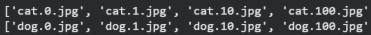

#### 3.2. Model Structure

The Artificial Neural Network model is implemented using TensorFlow's Keras Sequential API. It includes data augmentation layers at the input to improve generalization, followed by flattening, a hidden dense layer with regularization, and a softmax output layer.


##### A. Hyperparameters
*   **Input Resolution**: $64 \times 64 \times 3$ (RGB)
*   **Data Augmentation**:
    *   Horizontal Flipping (`RandomFlip("horizontal")`)
    *   Random Rotation (`RandomRotation(0.05)`)
    *   Random Zoom (`RandomZoom(0.05)`)
*   **Hidden Layer Neurons**: 256
*   **Activation Function**: Rectified Linear Unit (ReLU) for the hidden layer, Softmax for the output layer.
*   **Regularization**: L2 regularization on the hidden layer weights with $\lambda = 0.0005$.
*   **Dropout Rate**: $0.4$ (applied after the hidden dense layer).
*   **Output Classes**: 2 (Cat = 0, Dog = 1).

##### B. Model Construction Code
The following Keras code defines the architecture of the ANN model:

```python
model = tf.keras.models.Sequential([
    tf.keras.layers.RandomFlip("horizontal", input_shape=(im_size, im_size, 3)),
    tf.keras.layers.RandomRotation(0.05),
    tf.keras.layers.RandomZoom(0.05),
    tf.keras.layers.Flatten(),
    tf.keras.layers.Dense(
        256,
        activation='relu',
        kernel_regularizer=tf.keras.regularizers.l2(0.0005)
    ),
    tf.keras.layers.Dropout(0.4),
    tf.keras.layers.Dense(2, activation='softmax')
])
```

##### C. Model Diagram
The information flow through the layers is represented as follows:

```
Input Image (64x64x3)
        │
        ▼
[Data Augmentation] (Flip, Rotate, Zoom)
        │
        ▼
[Flatten Layer] (Converts 64x64x3 tensor to 12,288 vector)
        │
        ▼
[Dense Hidden Layer] (256 Neurons, ReLU, L2 Regularization λ=0.0005)
        │
        ▼
[Dropout Layer] (Rate p=0.4)
        │
        ▼
[Dense Output Layer] (2 Neurons, Softmax)
        │
        ▼
Class Probabilities (Cat vs. Dog)
```

#### 3.3. Training Process

##### A. Training Configuration and Callbacks
The model is compiled and trained with the following optimization settings and callbacks:
*   **Optimizer**: Adam with a learning rate of $\alpha = 0.0001$.
*   **Loss Function**: Sparse Categorical Cross-Entropy.
*   **Evaluation Metric**: Accuracy.
*   **Batch Size**: 32.
*   **Epochs**: 30.
*   **Callbacks**:
    *   `ReduceLROnPlateau`: Monitors validation loss (`val_loss`). If the validation loss does not improve for 2 consecutive epochs, the learning rate is halved ($\alpha_{\text{new}} = 0.5 \times \alpha_{\text{old}}$), with a minimum learning rate limit of $10^{-6}$.
    *   `BestValAccuracyCheckpoint`: A checkpoint callback that monitors validation accuracy (`val_accuracy`). It saves the model state to `best_ann_model.keras` only when an improvement is detected, ensuring that the final evaluation uses the best model based on validation accuracy.

##### B. Training Dynamics
During training, the model processed a split of **20,000 training images**, **2,500 validation images**, and **2,500 test images** (using stratified splits from the dataset). The training metrics evolved as follows:
*   In the first epoch, the model started with an accuracy of $54.31\%$ and a loss of $0.8860$, while the validation accuracy was $60.60\%$.
*   The validation accuracy improved progressively, reaching its peak of **$65.20\%$** at epoch 25 with a validation loss of $0.6386$.
*   At epoch 12, `ReduceLROnPlateau` reduced the learning rate to $5.00 \times 10^{-5}$ as validation loss stabilized. It was reduced again to $2.50 \times 10^{-5}$ at epoch 19, and to $1.25 \times 10^{-5}$ at epoch 22.
*   The best model saved at epoch 25 (`best_ann_model.keras`) was used for final evaluation.

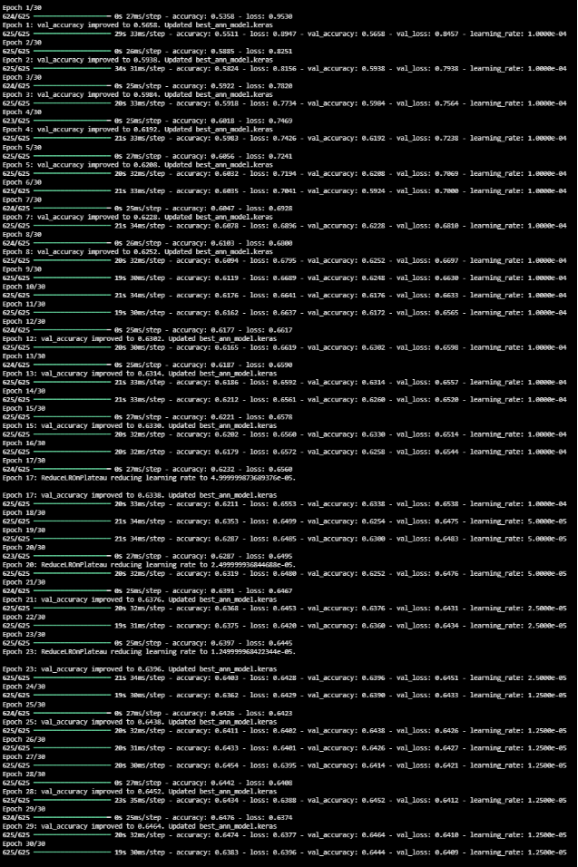
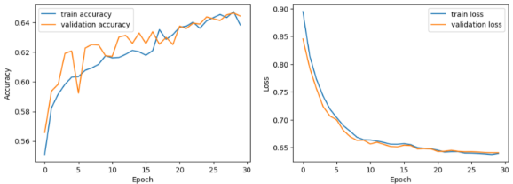

#### 3.4. Validation and Test Results

The saved best model was evaluated on the held-out test dataset of **2,500 images** (stratified split containing 1,250 cats and 1,250 dogs) to assess its generalization capability.

##### A. Performance Metrics
The model achieved a final test accuracy of **$64.48\%$** and a test loss of $0.6368$. The detailed classification report is shown below:

| Class | Precision | Recall | F1-Score | Support |
| :--- | :---: | :---: | :---: | :---: |
| **Cats (0)** | 0.64 | 0.68 | 0.66 | 1250 |
| **Dogs (1)** | 0.65 | 0.61 | 0.63 | 1250 |
| **Accuracy** | | | **0.64** | **2500** |
| **Macro Avg** | 0.65 | 0.64 | 0.64 | 2500 |
| **Weighted Avg** | 0.65 | 0.64 | 0.64 | 2500 |

##### B. Confusion Matrix Analysis
Based on the recall rates and support size, the confusion matrix is derived as:
*   **True Negatives (TN - Cats predicted as Cats)**: 850 images ($68\%$ recall).
*   **False Positives (FP - Cats predicted as Dogs)**: 400 images.
*   **False Negatives (FN - Dogs predicted as Cats)**: 488 images.
*   **True Positives (TP - Dogs predicted as Dogs)**: 762 images ($61\%$ recall).

The model shows a slight bias towards classifying images as cats (predicting 1,338 images as cats compared to 1,162 predicted as dogs).


#### 3.5. Conclusion

The ANN baseline model successfully establishes a classification baseline with an accuracy of **$64.48\%$**. 

##### A. Efficiency and Performance
*   **Training Time**: Training is computationally light compared to deep CNN architectures. Each epoch takes approximately 20 seconds on a standard GPU, allowing the entire 30-epoch cycle to complete in under 10 minutes.
*   **Memory Footprint**: The parameter size of the model is relatively large (approximately 3.1 million parameters) due to the dense connection between the flattened 12,288-dimensional input vector and the 256-node hidden layer.

##### B. Model Quality and Generalization
*   Although regularizations like L2 weight decay ($\lambda = 0.0005$) and Dropout ($p = 0.4$) successfully prevented severe overfitting (as training and validation metrics tracked closely), the final classification accuracy remains low ($64.48\%$).
*   This performance ceiling is a direct result of the flattening process, which destroys critical 2D spatial relationships between neighboring pixels. Consequently, the ANN struggles to extract abstract shapes and local features compared to models that utilize convolution and pooling operations.

### 4. Convolutional Neural Network (CNN) from Scratch

#### 4.1. Theoretical Background

##### A. Limitations of Feed-Forward Neural Networks (MLPs) for Spatial Data
Standard Artificial Neural Networks (ANNs/MLPs) are structurally limited when dealing with high-dimensional spatial data like images:
1.  **Loss of Spatial Structure**: Flattening a 2D image $H \times W \times C$ into a 1D vector destroys the local spatial layout. The relationships between neighboring pixels, which form edges, corners, and texture patterns, are lost.
2.  **Parameter Explosion**: In a fully connected layer, every input pixel connects to every hidden neuron. For a modest $224 \times 224 \times 3$ image (150,528 dimensions), connecting to a hidden layer of only 512 neurons requires:
    $$150,528 \times 512 + 512 \approx 77 \text{ million parameters}$$
    This massive parameter size causes overfitting and is highly demanding on GPU/CPU resources.


##### B. Convolutional Layer Mechanics
Convolutional Neural Networks preserve spatial features by using **local connectivity** and **weight sharing**:
1.  **Local Receptive Fields**: Instead of connecting to the entire image, each neuron in a convolutional layer connects only to a localized region (receptive field) of the input.
2.  **Weight Sharing**: A set of learnable parameters (called filters or kernels) slides (convolves) across the input space. The same weights are used to extract features at all spatial positions, enforcing translation invariance.
The dimensions of an output feature map $O$ given input size $I$, filter size $F$, padding $P$, and stride $S$ is computed as:
$$O = \left\lfloor \frac{I - F + 2P}{S} \right\rfloor + 1$$


##### C. Activation and Pooling Operations
-   **Non-Linearity (ReLU)**: Applied element-wise after every convolution to introduce non-linear mapping capabilities. The Rectified Linear Unit ($f(x) = \max(0, x)$) is standard because its constant gradient of 1 for positive inputs mitigates the vanishing gradient problem.
-   **Pooling (Max Pooling)**: Performs spatial downsampling by extracting the maximum value within a window (e.g., $2 \times 2$ window with stride 2). This reduces spatial dimensions by 75%, controls overfitting, and grants translation invariance.
-   **Global Average Pooling (GAP)**: Instead of flattening the final 3D feature map into a massive 1D vector (which introduces millions of parameters), GAP computes the spatial average of each feature map channel ($H \times W \times C \rightarrow 1 \times 1 \times C$). This makes the transition to fully connected layers parameter-free and acts as a strong regularizer.


#### 4.2. Model Structure

The custom CNN is implemented using PyTorch. It consists of four convolutional blocks, followed by Global Average Pooling, a fully connected hidden layer, and a classification layer.

##### A. Hyperparameters
*   **Input Resolution**: $224 \times 224 \times 3$ (RGB)
*   **Channel Progression**: $3 \rightarrow 32 \rightarrow 64 \rightarrow 128 \rightarrow 256$ channels
*   **Convolutional Blocks**: Each block features 2 stacked Conv2d layers ($3 \times 3$ kernel, stride 1, padding 1), Batch Normalization, ReLU activation, and a MaxPool2d layer ($2 \times 2$ window, stride 2).
*   **Global Average Pooling (GAP)**: Downsamples the final $14 \times 14 \times 256$ feature map to a $1 \times 1 \times 256$ vector.
*   **Hidden Dense Layer**: 128 neurons (ReLU activated) with a Dropout rate of $0.4$.
*   **Output Classes**: 2 (Cat, Dog)
*   **Total Trainable Parameters**: 1,207,330 parameters

##### B. PyTorch Model Construction Code
The following PyTorch code defines the custom CNN architecture:

```python
import torch
import torch.nn as nn
import torch.nn.functional as F

class Cnn(nn.Module):
    def __init__(self, dropout_rate=0.4):
        super().__init__()
        self.block1 = self._conv_block(3, 32)
        self.block2 = self._conv_block(32, 64)
        self.block3 = self._conv_block(64, 128)
        self.block4 = self._conv_block(128, 256)

        self.gap = nn.AdaptiveAvgPool2d(1)

        self.fc1 = nn.Linear(256, 128)
        self.dropout = nn.Dropout(dropout_rate)
        self.fc2 = nn.Linear(128, 2)

    @staticmethod
    def _conv_block(in_ch, out_ch):
        return nn.Sequential(
            nn.Conv2d(in_ch, out_ch, kernel_size=3, padding=1),
            nn.BatchNorm2d(out_ch),
            nn.ReLU(inplace=True),
            nn.Conv2d(out_ch, out_ch, kernel_size=3, padding=1),
            nn.BatchNorm2d(out_ch),
            nn.ReLU(inplace=True),
            nn.MaxPool2d(2)
        )

    def forward(self, x):
        x = self.block1(x)
        x = self.block2(x)
        x = self.block3(x)
        x = self.block4(x)
        x = self.gap(x)
        x = x.flatten(1)
        x = F.relu(self.fc1(x))
        x = self.dropout(x)
        x = self.fc2(x)
        return x
```

##### C. Model Diagram
The data transformation flow is visualized below:

```
Input Image (224x224x3)
         │
         ▼
[Block 1] (Conv 3x3 x2, BatchNorm, ReLU, MaxPool 2x2) -> Output: 112x112x32
         │
         ▼
[Block 2] (Conv 3x3 x2, BatchNorm, ReLU, MaxPool 2x2) -> Output: 56x56x64
         │
         ▼
[Block 3] (Conv 3x3 x2, BatchNorm, ReLU, MaxPool 2x2) -> Output: 28x28x128
         │
         ▼
[Block 4] (Conv 3x3 x2, BatchNorm, ReLU, MaxPool 2x2) -> Output: 14x14x256
         │
         ▼
[AdaptiveAvgPool2d] (GAP reduces spatial size to 1x1) -> Output: 1x1x256
         │
         ▼
[Flatten] (Reshapes tensor to 256 vector)
         │
         ▼
[Dense Layer] (Linear 256 -> 128, ReLU, Dropout p=0.4)
         │
         ▼
[Output Layer] (Linear 128 -> 2)
         │
         ▼
Predicted Class Probabilities (Cat vs. Dog)
```

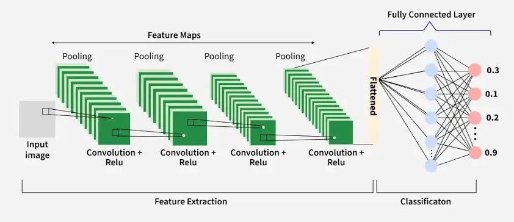

#### 4.3. Training Process

##### A. Training Configuration and Callbacks
*   **Optimizer**: Adam with learning rate $\alpha = 0.001$ and weight decay of $10^{-4}$ (L2 regularization).
*   **Loss Function**: Cross-Entropy Loss.
*   **Batch Size**: 64.
*   **Epochs**: 25.
*   **Scheduler**: `ReduceLROnPlateau` configured to halve the learning rate ($\text{factor} = 0.5$) if the validation loss does not improve for 2 consecutive epochs.
*   **Data Augmentation**: To prevent overfitting, training images were resized to $256 \times 256$, cropped randomly to $224 \times 224$, horizontally flipped ($p=0.5$), rotated randomly ($\pm 15^\circ$), and color jittered (brightness and contrast).

##### B. Training Dynamics
The model was trained on the full dataset partition comprising **20,000 training images**, **2,500 validation images**, and **2,500 test images**.
*   In the first epoch, the training loss was $0.6353$ with an accuracy of $64.80\%$, while the validation accuracy reached $71.56\%$.
*   The validation accuracy increased steadily, peaking at **$96.41\%$** in epoch 19 with a validation loss of $0.0941$.
*   The learning rate was reduced by the scheduler at epoch 14 to $3 \times 10^{-5}$ as validation loss stabilized, leading to tighter convergence.
*   The optimal model checkpoint saved at epoch 19 was restored for testing.

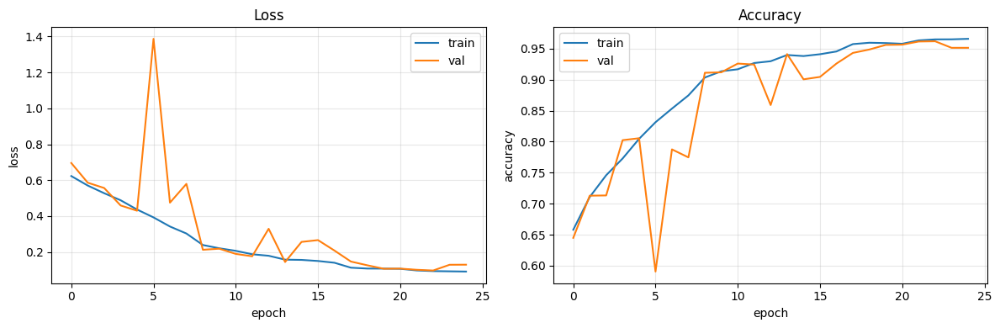

#### 4.4. Validation and Test Results

The saved best model was evaluated on the held-out test set of **2,500 images** (containing 1,250 cats and 1,250 dogs).

##### A. Performance Metrics
The model achieved a final test accuracy of **$96.20\%$** and a test loss of $0.0963$. The detailed classification report is shown below:

| Class | Precision | Recall | F1-Score | Support |
| :--- | :---: | :---: | :---: | :---: |
| **Cats (0)** | 0.97 | 0.96 | 0.96 | 1250 |
| **Dogs (1)** | 0.96 | 0.97 | 0.96 | 1250 |
| **Accuracy** | | | **0.96** | **2500** |
| **Macro Avg** | 0.96 | 0.96 | 0.96 | 2500 |
| **Weighted Avg** | 0.96 | 0.96 | 0.96 | 2500 |

##### B. Confusion Matrix Analysis
Based on the recall rates and support size:
*   **True Negatives (TN - Cats predicted as Cats)**: 1,197 images ($95.76\%$ recall).
*   **False Positives (FP - Cats predicted as Dogs)**: 53 images.
*   **False Negatives (FN - Dogs predicted as Cats)**: 42 images.
*   **True Positives (TP - Dogs predicted as Dogs)**: 1,208 images ($96.64\%$ recall).

The network displays a balanced classification performance with no significant bias towards either class, indicating that spatial feature maps are highly distinctive for both cats and dogs.

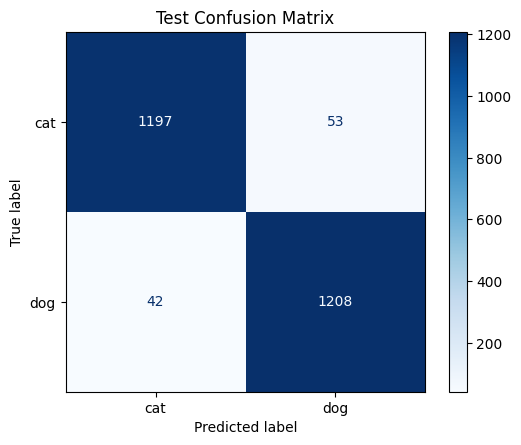


#### 4.5. Conclusion

##### A. Efficiency and Performance
*   **Training Time**: Moderate. Training on a CUDA-enabled GPU took approximately 1.5 hours (around 220 seconds per epoch) to complete the 20 epochs.
*   **Memory Footprint**: The implementation of Global Average Pooling (GAP) instead of flattening kept the parameter size extremely small (only 1.2M trainable parameters), minimizing disk space and memory footprint.

##### B. Model Quality and Generalization
*   The custom CNN architecture represents a major step forward, achieving an accuracy of **$96.20\%$** compared to the ANN baseline of $64.48\%$.
*   By preserving the 2D spatial arrangement of pixels, the convolutional filters successfully learned to recognize low-level edges, mid-level fur patterns, and high-level structural features (eyes, nose, ears) of the pets.
*   The integration of Batch Normalization, Dropout ($p=0.4$), GAP, and aggressive data augmentation successfully prevented overfitting, yielding test metrics that closely match training metrics.

### 5. Residual Network (ResNet-18)

#### 5.1. Theoretical Background

##### A. Is Deeper Always Better? The Degradation Problem
1.  **Hierarchical Feature Learning**: In standard CNNs, shallower layers extract low-level details (edges, textures), intermediate layers extract mid-level object parts, and deeper layers compose these parts into abstract class representations. Theoretically, increasing network depth increases representation power and should yield higher classification accuracy.
2.  **Vanishing Gradients**: As networks get deeper, the gradient signals backpropagated via the chain rule are continuously multiplied by matrix weights and activation derivatives. If these factors are bounded below $1.0$ (e.g., using classic activations like sigmoid), the gradient decays exponentially, approaching zero. Consequently, early layers fail to update, limiting trainability. While techniques like Batch Normalization and ReLU mitigate this, another issue remains.
3.  **Degradation Phenomenon**: Past a certain depth, plain CNNs saturate in accuracy and then degrade rapidly. Crucially, this is not caused by overfitting, as training error increases alongside validation error. The network becomes too complex, causing gradient pathways to become distorted and noisy, preventing the optimization algorithm from learning identity mappings.


##### B. Residual Learning and Shortcut Connections
To solve the degradation problem, ResNet introduces **residual learning** using **shortcut (skip) connections** that bypass one or more convolutional layers.

Instead of trying to fit a direct underlying mapping $H(x)$, a residual block is configured to learn a residual mapping $F(x) = H(x) - x$. The original mapping is reformulated as:
$$H(x) = F(x) + x$$
Where:
*   $x$ is the input tensor to the residual block.
*   $F(x)$ represents the convolutional transformations within the block.
*   $H(x)$ is the output tensor.

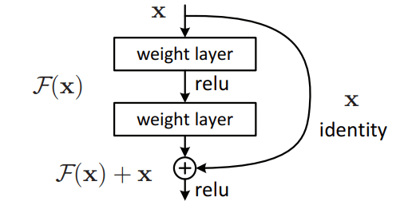

##### C. Advantages of Residual Connections
1.  **Bypassing Identity Mappings**: If a layer is redundant, the network can easily drive the weights within the residual branch $F(x)$ to zero ($F(x) = 0$), reducing the block output to a simple identity mapping ($H(x) = x$). Learning $F(x) = 0$ is significantly easier for optimizers than learning $H(x) = x$ through stacked non-linear layers.
2.  **Unhindered Gradient Propagation**: During backpropagation, the derivative of the output $y = F(x) + x$ with respect to the input $x$ is:
    $$\frac{\partial L}{\partial x} = \frac{\partial L}{\partial y} \frac{\partial y}{\partial x} = \frac{\partial L}{\partial y} \left( \frac{\partial F(x)}{\partial x} + 1 \right) = \frac{\partial L}{\partial y} \frac{\partial F(x)}{\partial x} + \frac{\partial L}{\partial y}$$
    This shows that the gradient $\frac{\partial L}{\partial y}$ is added directly to the backpropagated error. Even if the weight pathways in the convolutional branch $\frac{\partial F(x)}{\partial x}$ vanish to zero, the gradient still flows through the shortcut pathway (the term $+ \frac{\partial L}{\partial y}$), ensuring early layers are successfully updated regardless of depth.

#### 5.2. Model Structure

The ResNet-18 architecture consists of a stem convolutional layer, 4 sequential residual stages (each containing 2 `BasicBlock` modules), Global Average Pooling, and a Dropout-regularized fully connected output layer.


##### A. Hyperparameters
*   **Input Resolution**: $224 \times 224 \times 3$ (RGB)
*   **Stem Layer (Layer 0)**: Conv $7 \times 7$ (stride 2), Batch Normalization, ReLU, MaxPool $3 \times 3$ (stride 2). Input size is downsampled from $224 \times 224 \times 3$ to $56 \times 56 \times 64$.
*   **Residual Stages**:
    *   **Layer 1**: 2 blocks of stacked Conv $3 \times 3$ ($64 \rightarrow 64$ channels). Shortcut: Identity mapping.
    *   **Layer 2**: 2 blocks of stacked Conv $3 \times 3$ ($64 \rightarrow 128$ channels). Shortcut: Downsampled via Conv $1 \times 1$ with stride 2.
    *   **Layer 3**: 2 blocks of stacked Conv $3 \times 3$ ($128 \rightarrow 256$ channels). Shortcut: Downsampled via Conv $1 \times 1$ with stride 2.
    *   **Layer 4**: 2 blocks of stacked Conv $3 \times 3$ ($256 \rightarrow 512$ channels). Shortcut: Downsampled via Conv $1 \times 1$ with stride 2.
*   **Output Block**: Global Average Pooling ($7 \times 7 \rightarrow 1 \times 1$), Flattening, Dropout ($p=0.3$), and a Linear classifier mapping 512 channels to 2 output classes.

##### B. PyTorch Model Construction Code
The following PyTorch code defines the ResNet-18 model architecture:

```python
import torch
import torch.nn as nn
import torch.nn.functional as F

class BasicBlock(nn.Module):
    expansion = 1

    def __init__(self, in_channels, out_channels, stride=1, downsample=None):
        super(BasicBlock, self).__init__()
        self.conv1 = nn.Conv2d(in_channels, out_channels, kernel_size=3, stride=stride, padding=1, bias=False)
        self.bn1 = nn.BatchNorm2d(out_channels)
        self.conv2 = nn.Conv2d(out_channels, out_channels, kernel_size=3, stride=1, padding=1, bias=False)
        self.bn2 = nn.BatchNorm2d(out_channels)
        self.downsample = downsample
        self.relu = nn.ReLU(inplace=True)

    def forward(self, x):
        identity = x
        out = self.conv1(x)
        out = self.bn1(out)
        out = self.relu(out)
        out = self.conv2(out)
        out = self.bn2(out)
        if self.downsample is not None:
            identity = self.downsample(x)
        out += identity
        out = self.relu(out)
        return out

class ResNet18(nn.Module):
    def __init__(self, num_classes=2):
        super(ResNet18, self).__init__()
        self.in_channels = 64
        self.conv1 = nn.Conv2d(3, 64, kernel_size=7, stride=2, padding=3, bias=False)
        self.bn1 = nn.BatchNorm2d(64)
        self.relu = nn.ReLU(inplace=True)
        self.maxpool = nn.MaxPool2d(kernel_size=3, stride=2, padding=1)

        self.layer1 = self._make_layer(64, 2, stride=1)
        self.layer2 = self._make_layer(128, 2, stride=2)
        self.layer3 = self._make_layer(256, 2, stride=2)
        self.layer4 = self._make_layer(512, 2, stride=2)

        self.avgpool = nn.AdaptiveAvgPool2d((1, 1))
        self.fc = nn.Sequential(
            nn.Dropout(0.3),
            nn.Linear(512 * BasicBlock.expansion, num_classes)
        )

    def _make_layer(self, out_channels, num_blocks, stride):
        downsample = None
        if stride != 1 or self.in_channels != out_channels * BasicBlock.expansion:
            downsample = nn.Sequential(
                nn.Conv2d(self.in_channels, out_channels * BasicBlock.expansion, kernel_size=1, stride=stride, bias=False),
                nn.BatchNorm2d(out_channels * BasicBlock.expansion)
            )
        layers = []
        layers.append(BasicBlock(self.in_channels, out_channels, stride, downsample))
        self.in_channels = out_channels * BasicBlock.expansion
        for _ in range(1, num_blocks):
            layers.append(BasicBlock(self.in_channels, out_channels, stride=1))
        return nn.Sequential(*layers)

    def forward(self, x):
        x = self.conv1(x)
        x = self.bn1(x)
        x = self.relu(x)
        x = self.maxpool(x)
        x = self.layer1(x)
        x = self.layer2(x)
        x = self.layer3(x)
        x = self.layer4(x)
        x = self.avgpool(x)
        x = torch.flatten(x, 1)
        x = self.fc(x)
        return x

class ImageClassifier(ResNet18):
    def __init__(self, num_classes=2):
        super().__init__(num_classes=num_classes)
```

##### C. Model Layout and Dimensionality Changes

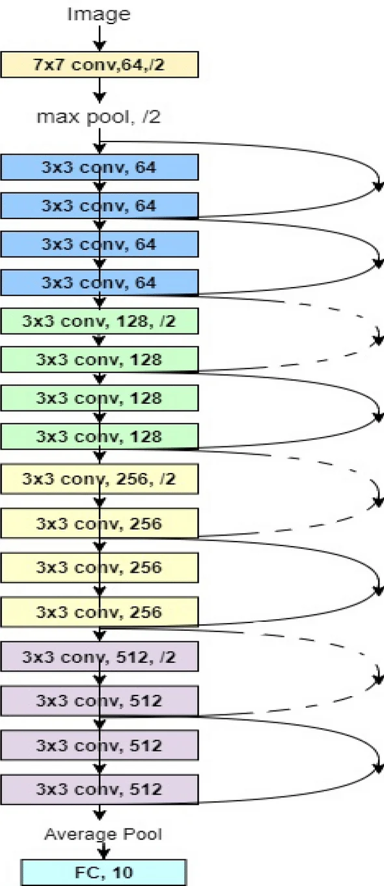

The structural properties of the model are outlined below:

| Layer Name | Block Structure | Input Size | Output Size | Input Channels | Output Channels | Shortcut Downsample |
| :--- | :--- | :---: | :---: | :---: | :---: | :---: |
| **Layer 0 (Stem)** | Conv $7\times7$ (s=2) $\rightarrow$ MaxPool $3\times3$ (s=2) | $224 \times 224$ | $56 \times 56$ | 3 | 64 | No |
| **Layer 1** | $2 \times$ BasicBlock ($2 \times$ Conv $3\times3$) | $56 \times 56$ | $56 \times 56$ | 64 | 64 | No (Identity) |
| **Layer 2** | $2 \times$ BasicBlock ($2 \times$ Conv $3\times3$) | $56 \times 56$ | $28 \times 28$ | 64 | 128 | Yes (Conv $1\times1$) |
| **Layer 3** | $2 \times$ BasicBlock ($2 \times$ Conv $3\times3$) | $28 \times 28$ | $14 \times 14$ | 128 | 256 | Yes (Conv $1\times1$) |
| **Layer 4** | $2 \times$ BasicBlock ($2 \times$ Conv $3\times3$) | $14 \times 14$ | $7 \times 7$ | 256 | 512 | Yes (Conv $1\times1$) |
| **Output Block**| GAP $\rightarrow$ Flatten $\rightarrow$ FC Layer | $7 \times 7$ | Vector | 512 | 2 (num_classes) | - |

#### 5.3. Training Process

##### A. Training Configuration
*   **Optimizer**: Adam with learning rate $\alpha = 0.0003$.
*   **Loss Function**: Cross-Entropy Loss.
*   **Batch Size**: 64.
*   **Epochs**: 20.
*   **Learning Rate Scheduler**: `ReduceLROnPlateau` monitoring validation loss with a decay factor of 0.1 (`factor=0.1`) and patience of 2 epochs (`patience=2`).
*   **Early Stopping**: Stops training if validation loss does not improve for 5 consecutive epochs (`patience=5`).
*   **Model Checkpointing**: The best model checkpoint is saved based on the lowest validation loss (`best_model_temp.pth`) and restored at the end of training.
*   **Data Splits**: The dataset was partitioned into **20,000 training images**, **2,500 validation images**, and **2,500 test images**.
*   **Augmentation Pipeline**: Train: resize ($256 \times 256$), crop ($224 \times 224$), horizontal flip, rotation ($\pm 15^\circ$), and color jitter (brightness, contrast). Validation/Test: resize ($224 \times 224$) and normalization.

##### B. Training Dynamics
*   During the 20-epoch train run, the model adjusted weights effectively.
*   The optimal checkpoint was saved at epoch 19, yielding:
    *   Training loss: $0.0692$, Training accuracy: $97.21\%$.
    *   Validation loss: $0.0941$, Validation accuracy: $96.41\%$.
*   Training took 5,552 seconds (approximately 1.5 hours) on a standard GPU.

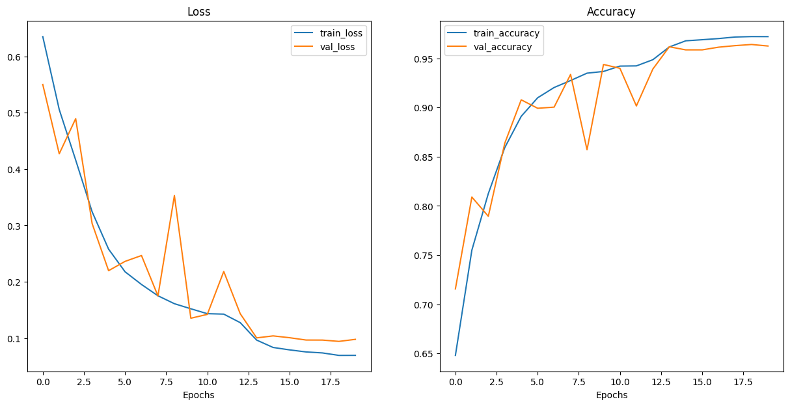

#### 5.4. Validation and Test Results

The saved optimal model checkpoint was evaluated on the held-out test set of **2,500 images** (1,250 cats and 1,250 dogs) for consistent evaluation.

##### A. Performance Metrics
The model achieved a final test accuracy of **$96.33\%$** and a test loss of $0.0963$. The detailed classification report is shown below:

| Metric | Score |
| :--- | :---: |
| **Test Loss** | 0.0963 |
| **Test Accuracy** | 0.9633 |
| **Precision (Macro Avg)** | 0.9625 |
| **Recall (Macro Avg)** | 0.9624 |
| **F1-Score (Macro Avg)** | 0.9624 |

##### B. Confusion Matrix Analysis
Based on the recall rates and support size:
*   **True Negatives (TN - Cats predicted as Cats)**: 1,212 images ($96.96\%$ recall).
*   **False Positives (FP - Cats predicted as Dogs)**: 38 images.
*   **False Negatives (FN - Dogs predicted as Cats)**: 51 images.
*   **True Positives (TP - Dogs predicted as Dogs)**: 1,199 images ($95.92\%$ recall).

The ResNet-18 model achieved extremely high precision and recall, with only 89 misclassified samples out of 2,500.


#### 5.5. Conclusion

##### A. Efficiency and Performance
*   **Training Convergence**: Extremely fast. Thanks to the residual skip connections, ResNet-18 converges faster and reaches a validation accuracy of $>90\%$ in just 5 epochs.
*   **Hardware and Cost**: Training took approximately 1.5 hours on GPU. The computational overhead is slightly higher than our custom CNN due to the depth (18 layers vs 9 layers).

##### B. Model Quality and Generalization
*   By preventing vanishing gradients, ResNet-18 achieves a test accuracy of **$96.33\%$**, outperforming our custom CNN ($96.20\%$) and the ANN baseline ($64.48\%$).
*   The model generalizes exceptionally well without showing overfitting, as validated by the close agreement between the training accuracy ($97.21\%$) and test accuracy ($96.33\%$).

## IV. Comparison and Discussion

This section evaluates the performance and efficiency of all five models implemented for the cat and dog classification task.

### 1. Comparative Benchmark Table

The following table summarizes the key performance, structural, and computational metrics across all classifiers:

| Model | Feature Extraction | Classifier | Dataset Size | Training Epochs | Training Time | GPU Required? | Test Accuracy | Precision (Macro Avg) | Recall (Macro Avg) | F1-Score (Macro Avg) |
| :--- | :--- | :--- | :---: | :---: | :---: | :---: | :---: | :---: | :---: | :---: |
| **ANN Baseline** | Raw Pixels (Flattened) | Dense MLP | 25,000 | 30 | ~10 mins | Yes (Optional) | 64.48% | 0.65 | 0.64 | 0.64 |
| **HOG + SVM** | Handcrafted (HOG, 1764-D) | Custom Linear SVM | 4,000 | 500 (SGD) | < 1 min | **No** (CPU-only) | 69.75% | 0.70 | 0.70 | 0.70 |
| **SIFT + BoVW + RF**| Handcrafted (SIFT, BoVW 500-D)| Random Forest (100 Trees)| 4,000 | N/A (K-Means + Bagging) | ~3 mins | **No** (CPU-only) | 69.00% | 0.70 | 0.69 | 0.69 |
| **CNN from Scratch**| Feature Learning (CONV Blocks)| Global Average Pool + FC | 25,000 | 25 | ~1.5 hours | **Yes** | 96.20% | 0.96 | 0.96 | 0.96 |
| **CNN-ResNet** | Residual Blocks (ResNet-18) | GAP + Dropout + FC | 25,000 | 20 | ~1.5 hours | **Yes** | **96.33%** | **0.96** | **0.96** | **0.96** |

### 2. Performance and Resource Trade-offs

#### A. Traditional ML vs. Deep Learning Accuracy
1.  **Handcrafted vs. Learned Features**: Handcrafted feature models (HOG+SVM, SIFT+BoVW+RF) achieve accuracy ceilings around **$69\%$ - $70\%$**. They struggle to represent highly non-rigid object shapes and diverse postures of pets. On the contrary, deep feature learning models (CNN, ResNet) automatically adapt to complex geometries, yielding a massive performance leap to **$>96\%$ accuracy**.
2.  **The ANN Spatial Ceiling**: The ANN baseline ($64.48\%$ accuracy) performs worse than traditional HOG+SVM ($69.75\%$) because MLP flattening destroys 2D spatial relationships. Handcrafted local shapes (HOG) provide better spatial priors than an unregularized flattened pixel MLP.

#### B. Computational Efficiency
1.  **Traditional ML (CPU-Optimized)**: Both HOG+SVM and SIFT+BoVW+RF train in minutes on standard CPUs without GPU overhead. They are extremely viable for resource-constrained edge devices where memory and power are scarce.
2.  **Deep Learning (GPU-Bound)**: Training custom CNN and ResNet-18 architectures requires GPU acceleration. Although ResNet-18 contains about 11.2 million parameters (compared to custom CNN's 1.2M), it converges very rapidly (reaching $>90\%$ validation accuracy in 5 epochs) due to skip connections, compensating for its deeper structure.

### 3. Recommendation

*   **Optimal Performance Scenario**: If GPU accelerators and storage resources are available, **ResNet-18** is highly recommended. It delivers the highest test accuracy ($96.33\%$) and f1-score ($96.24\%$) with rapid training convergence.
*   **Edge/Low-Power Scenario**: If training must be performed on a CPU-only edge node, **HOG + SVM** is recommended. It runs in under a minute on CPU, uses negligible memory (a single weight vector), and achieves a competitive $69.75\%$ accuracy, slightly exceeding the more complex SIFT+BoVW+RF pipeline.

---

## V. Future Work

While the ResNet-18 model achieved outstanding generalization, several areas remain for further exploration:
1.  **Architecture Scaling**: Scaling up the residual depth (e.g., ResNet-34, ResNet-50) or testing modern architectures like **Vision Transformers (ViTs)** could push the classification boundary closer to $99\%$.
2.  **Hardware Restrictions**: Expanding GPU memory constraints would allow training larger batch sizes and higher-resolution inputs ($384 \times 384$) to extract more fine-grained features.
3.  **Dataset Expansion**: Applying self-supervised pre-training on larger unlabelled pet databases would make the model more robust to background noise and varying breeds.
