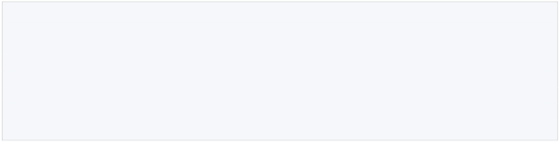
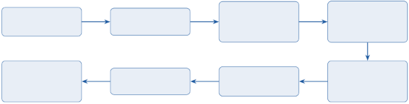
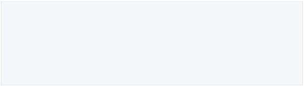
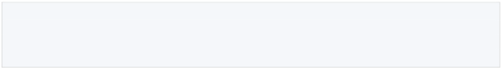
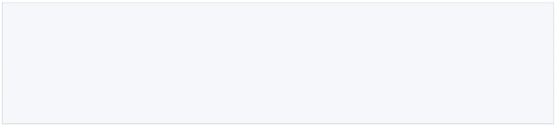
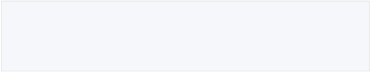
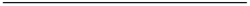
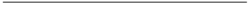
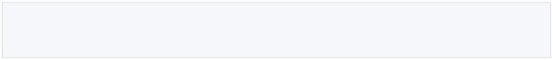
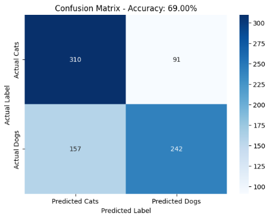

1  Introduction

This report describes a classical pipeline that distinguishes between photographs of cats and dogs. The system combines three distinct techniques:

1. Scale-Invariant Feature Transform for(SIFT) local keypoint detection and de- scription.
1. Bag of Visual Words (BoVW) to encode a variable-length set of SIFT descriptors as a fixed-length histogram over a learned visual vocabulary.
1. Random Forest (RF) as the final classification model.

The pipeline intentionally avoids convolutional neural networks in order to demonstrate that competitive accuracy could be achieved with traditional machine-learning classifiers, which are often more interpretable and faster to train on modest hardware.

2  Dataset
1. Source

The dataset is the Microsoft Cats and Dogs collection, originally distributed via the Kag- gle competition Dogs vs. Cats. It contains 25,000 labelled JPEG images split equally between cats and dogs.

1  !wget https://download.microsoft.com/download/.../ kagglecatsanddogs\_5340.zip
1  !unzip -q kagglecatsanddogs\_5340.zip -d dataset/

Downloading and unpacking the dataset

2. Sampling and Filtering

Working with the full 25,000-image corpus would be computationally expensive for SIFT extraction and K-Means clustering. A representative subset of 4,000 images (2,000 cats, 2,000 dogs) was therefore sampled. Images that could not be decoded by OpenCV were silently skipped to guard against corrupt files.

1 for clazz in os.listdir(base\_dir):

2 for file\_name in os.listdir(class\_dir):

3 img = cv2.imread(file\_path)

4 if img is not None:

5 label.append(0 if clazz == ’Cat’ else 1)

6 input\_path.append(file\_path)

7

8 df = df.sample(n=4000, random\_state=42).reset\_index(drop=True)

Building the data frame and subsampling

3. Label Encoding

Binary integer labels are used: 0 for Cat and 1 for Do .g The dataset was shuffled prior to sampling to avoid any ordering bias inherited from the directory structure.

3 Methodology

2

Raw Images (JPEG)

Random Forest (100 trees)

Grayscale\
Resize 256×256

Standard Scaler

SIFT\
Keypoints & Descriptors

Train/Test Split (80/20)

K-Means Vocabulary (k=500)

BoVW Histogram (L2-norm)

End-to-end classification pipeline.

1. SIFT Feature Extraction
1. Why SIFT?

SIFT produces descriptors that are invariant to image’s scale, rotation, and partially invariant to illumination change — properties that are valuable when pet photographs vary widely in pose, zoom level, and lighting conditions.

2. Implementation

Each image is converted to greyscale and resized to 256 × 256 pixels before feature ex- traction to standardise the input and reduce computation. OpenCV’s SIFT\_create() detector is applied with default parameters.

1 sift = cv2.SIFT\_create()

2

3 for idx, row in df.iterrows():

4 img = cv2.imread(row[’images’], cv2.IMREAD\_GRAYSCALE) 5 img = cv2.resize(img, (256, 256))

6 keypoints , descriptors = sift.detectAndCompute(img, None) 7 if descriptors is not None:

8 all\_descriptors.extend(descriptors)

9 image\_descriptors.append(descriptors)

SIFT extraction loop

Each SIFT descriptor is a 128-dimensional float32 vector. The total descriptor pool collected across the 4,000-image subset is passed to the vocabulary learning step.

2. Bag of Visual Words
1. Vocabulary Learning

A visual vocabulary of k = 500 “visual words” is learned by clustering all extracted descriptors with MiniBatchK-Means. MiniBatch K-Means processes the corpus in mini-batches of 2,048 descriptors, making it substantially faster than standard K-Means while achieving comparable cluster quality.

c∗ = argmin min ∥di − cj ∥2

c j 2

i

where d i are the SIFT descriptors and c j are the cluster centroids (visual words).

1  k\_clusters = 500
1  kmeans = MiniBatchKMeans(n\_clusters=k\_clusters , random\_state=42, 3 batch\_size=2048)

   4 kmeans.fit(all\_descriptors)

Vocabulary learning

2. Histogram Representation

Each image is represented as a normalised frequency histogram over the visualk words. For an image with descriptor set D, the -thj histogram bin is:

h = count(w j ∈ D), ε = 10 −7

j ∥h∥2 + ε

L2-normalisation ensures that images with different numbers of keypoints are compared fairly. The result is a fixed-length feature vector x ∈ R 150 per image.

1 for descriptors in image\_descriptors:

2 words = kmeans.predict(descriptors.astype(np.float32))

3 hist, \_ = np.histogram(words, bins=np.arange(k\_clusters + 1)

)

4 hist = hist.astype(float)

5 hist /= (np.linalg.norm(hist) + 1e-7) 6 X.append(hist)

Histogram generation

3. Classification: Random Forest
1. Train/Test Split

The dataset was divided with an 80/20 stratified split, preserving class balance in both partitions.

1 X\_train , X\_test, y\_train , y\_test = train\_test\_split( 2 X, y, test\_size=0.2, random\_state=42, stratify=y)

3

4  scaler = StandardScaler()
4  X\_train\_scaled = scaler.fit\_transform(X\_train)
4  X\_test\_scaled = scaler.transform(X\_test)

Stratified split and feature scaling

2. Random Forest Hyperparameters\
   Parameter Value

   n\_estimators 100

   max\_features "sqrt" (default)

   criterion gini (default)

   random\_state 42

1  model = RandomForestClassifier(n\_estimators=100, random\_state =42)
1  model.fit(X\_train\_scaled , y\_train)

Listing 1: Model training

4  Results and Evaluation
1. Performance Metrics

Model performance was assessed on the held-out test set (800 images). The classifier achieved the following results:

|Class Precision Recall F1-Score Support|
| - |
|Cat (0) 0.66 0.77 0.71 401 Dog (1) 0.73 0.61 0.66 399|
|Accuracy Reported at runtime 69.00%|

2. Confusion Matrix

The confusion matrix is plotted with Seaborn and provides a per-class breakdown of true positives, false positives, true negatives, and false negatives.

3. Discussion

Strengths.

- No GPU required The. entire pipeline runs on CPU, making it accessible for resource-constrained environments.
- Interpretabilit Randomy. Forest provides feature importance scores that can reveal which visual words are most discriminative.
- Robustness to keypoint density variation. L2-normalised histograms compensate for images that yield different numbers of SIFT keypoints.

Limitations.

- Accuracy ceiling. Classical BoVW pipelines typically plateau well below deep CNN baselines (which achieve >99% on this dataset). Global texture and shape cues captured by BoVW are insufficient for fine-grained visual distinctions.
- Vocabulary size sensitivit They. choice of k = remains500 heuristic; under- clustering loses discriminative detail while over-clustering causes descriptor assignment noise and increases memory footprint. Systematic cross-validation is still needed to confirm 500 is optimal.
- Spatial information discarded. Standard BoVW ignores keypoint locations, losing structural context (e.g. a dog’s muzzle at the centre vs. background).
5  Conclusion
- This project implements a cat vs. dog classifier using SIFT, BoVW, and a Random Forest.
- The model trained on 3,200 images; tested on 800 by an 80/20 split.
- Features are scaled before training and prediction. The model yielded result at 69.00% accuracy
- Runs on CPU only — no GPU needed.
- Easy to read and understand, but has a lower accuracy ceiling than deep learning models.
- Keypoint positions are not used, which limits how well the model understands image structure.
6
